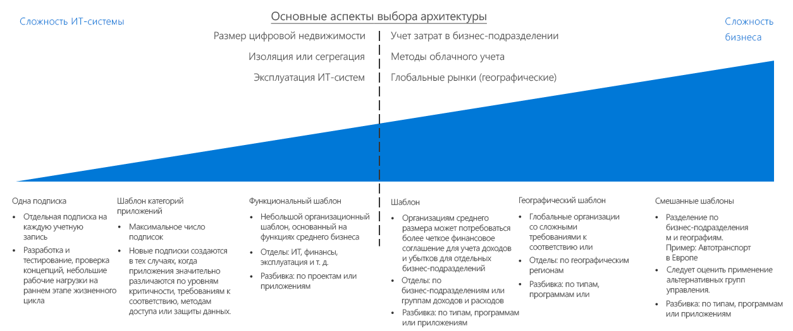
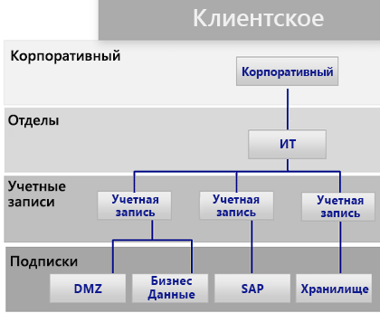
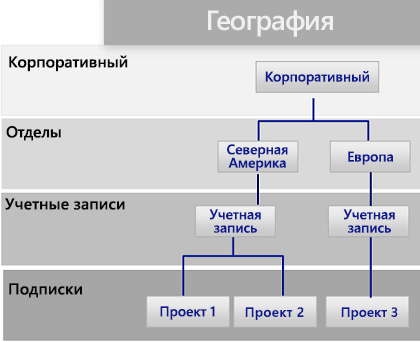

# Руководство по выбору модели подпискиSubscription decision guide

В основе всех облачных платформ лежит базовая модель владения, которая предоставляет организациям разнообразные возможности для выставления счетов и управления.All cloud platforms are based on a core ownership model that provides organizations with numerous billing and resource management options. Используемая в Azure структура отличается от тех, которые предлагают другие поставщики облачных служб. Она предусматривает несколько вариантов применения организационной иерархии и прав владения сгруппированными подписками.The structure that Azure uses is different from other cloud providers because it includes various support options for organizational hierarchy and grouped subscription ownership. В любом случае, как правило, один человек отвечает за выставление счетов, а другой назначается владельцем верхнего уровня для управления ресурсами.Regardless, there is generally one individual responsible for billing and another who is assigned as the top-level owner for managing resources.

Перейти к разделу: [Модели подписок и Соглашения Enterprise Azure](#subscriptions-design-and-azure-enterprise-agreements) | [Шаблоны моделей подписок](#subscription-design-patterns) | [Группы управления](#management-groups) | [Организация на уровне подписок](#organization-at-the-subscription-level)Jump to: [Subscriptions design and Azure Enterprise Agreements](#subscriptions-design-and-azure-enterprise-agreements) | [Subscription design patterns](#subscription-design-patterns) | [Management groups](#management-groups) | [Organization at the subscription level](#organization-at-the-subscription-level)

Использование определенной модели подписок — одна из самых распространенных стратегий, которую компании применяют для упорядочения или структурирования ресурсов при внедрении облачных решений.Subscription design is one of the most common strategies that companies use to establish a structure or organize assets during cloud adoption.

**Иерархия подписок**. *Подписка* — это логическая коллекция служб Azure (виртуальных машин, баз данных SQL, служб приложений и контейнеров).**Subscription hierarchy**: A *subscription* is a logical collection of Azure services (such as virtual machines, SQL DB, App Services, or containers). Каждый ресурс в Azure развертывается в одной подписке.Each asset in Azure is deployed to a single subscription. Каждая подписка принадлежит одной *учетной записи*Each subscription is then owned by one *account*. (пользователя или службы, что предпочтительнее), которая предоставляет доступ для выставления счетов и административных действий в рамках этой подписки.This account is a user account (or preferably a service account) that provides billing and administrative access across a subscription. Клиентам, которые обязуются использовать определенный объем ресурсов Azure в рамках Соглашения Enterprise (EA), предоставляется еще один уровень управления, который называется *подразделением*.For customers who have made a commitment to use a specific amount of Azure through an Enterprise Agreement (EA), another level of control called a *department* is added. На портале EA Portal с помощью подписок, учетных записей и подразделений можно создать удобную иерархию для выставления счетов и управления.In the EA portal, subscription, accounts, and departments can be used to create a hierarchy for billing and management purposes.

Разные модели подписок отличаются по уровню сложности.The complexity of subscription designs varies. При выборе модели подписки следует учитывать существующие линии разграничения, которые одновременно определяют бизнес-ограничения и ограничения, связанные с ИТ-технологиями.Decisions regarding a design strategy have unique inflection points, as they typically involve both business and IT constraints. Прежде, чем принимать технические решения, ИТ-архитекторы и руководители должны проконсультироваться с заинтересованными представителями бизнеса и командой по вопросам облачной стратегии. Это поможет определить требуемый подход к учету облачных ресурсов, используемые в бизнес-подразделениях методы учета затрат, а также глобальные потребности рынка для организации.Before making technical decisions, IT architects and decision makers should work with the business stakeholders and the cloud strategy team to understand the desired cloud accounting approach, cost accounting practices within your business units, and global market needs for your organization.

**Линия разграничения**. Пунктирная линия на приведенном выше рисунке (над ссылками) разграничивает простые и более сложные шаблоны моделей подписок.**Inflection point**: The dashed line in the image above references an inflection point between simple and more complex patterns for subscription design. Значительное влияние на модели подписок оказывают дополнительные точки принятия технических решений, предполагающие выбор размера цифровой инфраструктуры с учетом ограничений на подписки Azure, политик изоляции и разделения, а также операционных подразделений.Additional technical decision points based on digital estate size versus Azure subscription limits, isolation and segregation policies, and IT operational divisions usually have a significant effect on subscription design.

**Дополнительные рекомендации**. Выбирая модель подписки, важно помнить о том, что это не единственный способ группирования ресурсов или развертываний.**Other considerations**: An important thing to note when selecting a subscription design is that subscriptions aren’t the only way to group resources or deployments. Так как подписки были созданы еще на заре развития Azure, они наследуют ряд ограничений от прежних решений Azure, таких как диспетчер служб Azure.Subscriptions were created in the early days of Azure, as such they have limitations related to previous Azure solutions like Azure Service Manager.

Такие факторы, как структура развертывания, возможность автоматизации и наличие новых подходов к группированию ресурсов, также могут определять выбор модели подписки.Deployment structure, automation, and new approaches to grouping resources can affect your structure subscription design. Прежде чем принимать окончательное решение, определите то, как на ваш выбор влияет требование к [согласованности ресурсов](../resource-consistency/overview.md).Before finalizing a subscription design, consider how [resource consistency](../resource-consistency/overview.md) decisions might influence your design choices. Например, крупная транснациональная компания может сначала выбрать сложный шаблон управления подписками.For example, a large multinational organization might initially consider a complex pattern for subscription management. Но через некоторое время может оказаться, что гораздо удобнее будет использовать более простой шаблон бизнес-подразделения, который позволяет создавать иерархию групп управления.However, that same company might realize greater benefits with a simpler business unit pattern by adding a management group hierarchy.

## Модели подписок и Соглашения Enterprise AzureSubscriptions design and Azure Enterprise agreements

Все подписки Azure связаны с одной учетной записью, которая подключается к элементам управления верхнего уровня для выставления счетов и управления доступом для каждой подписки.All Azure subscriptions are associated with one account, which is connected to billing and top-level access control for each subscription. Одна учетная запись может владеть несколькими подписками, обеспечивая базовый уровень упорядочения подписок.A single account can own multiple subscriptions and can provide a base level of subscriptions organization.

Для небольших развертываний Azure одна подписка или их небольшой набор могут содержать все нужные облачные ресурсы.For small Azure deployments, a single subscription or a small collection of subscriptions may compose your entire cloud estate. Но в крупных развертываниях Azure, скорее всего, потребуются несколько подписок, чтобы обеспечить соответствие организационной структуре и решить вопросы, связанные с [квотами и ограничениями подписок](/azure/azure-subscription-service-limits).However, large Azure deployments likely need to span multiple subscriptions to support your organizational structure and bypass [subscription quotas and limits](/azure/azure-subscription-service-limits).

Каждое Соглашение Enterprise Azure предоставляет дополнительную возможность упорядочить подписки и учетные записи, используя иерархии, которые отражают организационные приоритеты.Each Azure Enterprise Agreement provides a further ability to organize subscriptions, and accounts into hierarchies that reflect your organizational priorities. Соглашение о регистрации Enterprise для вашей организации определяет структуру и способ использования служб Azure в вашей компании в контексте контракта.Your organizational enterprise enrollment defines the shape and use of Azure services within your company from a contractual point of view. Каждое Соглашение Enterprise позволяет дополнительно разделить окружение на подразделения, учетные записи и подписки в соответствии со структурой вашей организации.Within each enterprise agreement, you can further subdivide the environment into departments, accounts, and subscriptions to match your organization's structure.

## Конструктивные шаблоны подписокSubscription design patterns

Все организации отличаются друг от друга.Every enterprise is different. Поэтому иерархия "подразделение — учетная запись — подписка", реализованная в Соглашении Enterprise Azure, позволяет очень гибко упорядочивать ресурсы Azure.Therefore, the department/account/subscription hierarchy enabled throughout an Azure Enterprise Agreement allows for significant flexibility in how Azure is organized. Создание иерархии, отражающей потребности компании в выставлении счетов, управлении ресурсами и доступе к ресурсам, является первым и самым важным решением, которое следует принять, когда вы только начинаете работать с общедоступным облаком.Modeling your organization's hierarchy to reflect the needs of your company for billing, resource management, and resource access is the first, and most important, decision that you make when starting in the public cloud.

Следующие шаблоны подписок расположены в порядке возрастания сложности, требуемой для поддержки потенциальных организационных приоритетов.The following subscription patterns reflect a general increase in subscription design complexity to support potential organizational priorities:

### Одна подпискаSingle subscription

Одна подписка на учетную запись может оказаться достаточным решением для организаций, которым нужно небольшое количество облачных ресурсов.A single subscription per account may suffice for organizations that need to deploy a small number of cloud-hosted assets. Часто этот шаблон реализуется в самом начале внедрения облачных решений. Он позволяет создавать небольшие развертывания для экспериментов или подтверждения концепций при изучении возможностей облачной платформы.This is often the first subscription pattern you implement when beginning your cloud adoption process, allowing small-scale experimental or proof of concept deployments to explore the capabilities of a cloud platform.

Но в шаблоне одной подписки действуют технические ограничения на количество поддерживаемых ресурсов.However, there can be technical limitations to the number of resources that a single subscription will support. По мере увеличения облака есть смысл упорядочить ресурсы так, чтобы упростить применение политик и контроль доступа таким способом, который может не поддерживаться при использовании одной подписки.As the size of your cloud estate grows, you may likely want to also support organizing your resources to better organize policies and access control in a manner not supported with a single subscription.

### Шаблон категории приложенийApplication category pattern

С ростом облака в организации повышается потребность в использовании нескольких подписок.As the size of an organization's cloud footprint grows, the use of multiple subscriptions becomes increasingly likely. В этом сценарии подписки обычно создаются для приложений с фундаментальными отличиями в таких аспектах, как уровень важности для бизнеса, требования к обеспечению соответствия, элементы управления доступом и потребности в защите данных.In this scenario, subscriptions are generally created to support applications that have fundamental differences in business criticality, compliance requirements, access controls, or data protection needs. Подписки и учетные записи, которые поддерживают эти категории приложений, группируются в одно подразделение, которым владеют сотрудники центрального ИТ-отдела.The subscriptions and accounts supporting these application categories are all organized under a single department which is owned and administered by central IT operations staff.

Каждая организация выберет свой вариант классификации приложений, но чаще всего подписки будут разделяться по определенным приложениям, службам или типам приложений.Each organization will choose to categorize applications differently, often separating subscriptions based on specific applications or services or along the lines of application archetypes. Рабочие нагрузки, для которых может требоваться использование отдельных подписок в рамках этого шаблона, включают следующее:Workloads that might justify a separate subscription under this pattern include:

- экспериментальные приложения или приложения с низким уровнем риска;Experimental or low-risk applications
- приложения с защищенными данными;Applications with protected data
- критически важные рабочие нагрузки;Mission-critical workloads
- приложения, для которых действуют нормативные требования (например, HIPAA или FedRAMP);Applications subject to regulatory requirements (such as HIPAA or FedRAMP)
- рабочие нагрузки пакетной службы;Batch workloads
- рабочие нагрузки для обработки больших данных, например Hadoop;Big data workloads such as Hadoop
- контейнерные рабочие нагрузки с оркестраторами развертывания, например Kubernetes;Containerized workloads using deployment orchestrators such as Kubernetes
- рабочие нагрузки аналитики.Analytics workloads

Этот шаблон позволяет назначить несколько владельцев учетных записей, ответственных за определенные рабочие нагрузки.This pattern supports multiple accounts owners responsible for specific workloads. Этот шаблон не позволяет создавать более сложные структуры на уровне подразделения в иерархии Соглашения Enterprise, поэтому реализация Соглашения Enterprise Azure не требуется.As it lacks a more complex structure at the department level of the enterprise agreement hierarchy, this pattern does not require an Azure Enterprise Agreement to implement.

### Функциональной шаблонFunctional pattern

Этот шаблон позволяет упорядочить подписки и учетные записи по функциональной принадлежности. Например, вы можете разделить такие направления, как финансы, продажи или ИТ-поддержка, на основе иерархии "предприятие — подразделение — учетная запись — подписка", которая предоставляется клиентам в рамках Соглашения Enterprise Azure.This pattern organizes subscriptions and accounts along functional lines, such as finance, sales, or IT support, using the Enterprise/Department/Account/subscription hierarchy provided to Azure enterprise agreement customers.

### Шаблон бизнес-подразделенийBusiness unit pattern

Этот шаблон группирует подписки и учетные записи по категориям прибыли и убытка, бизнес-подразделений, отделов, центров прибыли или аналогичных бизнес-структур на основе иерархии Соглашения Enterprise Azure.This pattern groups subscriptions and accounts based on profit and loss category, business unit, division, profit center, or similar business structure using the Azure Enterprise Agreement hierarchy.

### Географической шаблонGeographic pattern

Этот шаблон подходит для организаций, действующих на глобальном уровне. Он группирует подписки и учетные записи по географическим регионам на основе иерархии Соглашения Enterprise Azure.For organizations with global operations, this pattern groups subscriptions and accounts based on geographic regions using the Azure Enterprise Agreement hierarchy.

### Смешанные шаблоныMixed patterns

Иерархия "предприятие — подразделение — учетная запись — подписка".enterprise/department/account/subscriptions hierarchy. Вы всегда можете объединить несколько шаблонов, например географические шаблоны и шаблоны бизнес-подразделений, чтобы структура точнее соответствовала сложным схемам выставления счетов и организационным структурам вашей компании.However, you can combine patterns such as geographic region and business unit to reflect more complex billing and organizational structures within your company. Кроме того, организационная структура и структура управления, определяемая моделью подписки, могут дополнительно расшириться в зависимости от выбора [модели согласованности ресурсов](../resource-consistency/overview.md).In addition, your [resource consistency design](../resource-consistency/overview.md) can further extend the governance and organizational structure of your subscription design.

Группы управления, описанные в следующем разделе, позволяют использовать более сложные организационные структуры.Management groups, as discussed in the following section, can help support more complicated organizational structures.

 Management groups, discussed in the following section, can help support more complicated organizational structures.

## Группы управленияManagement groups

Кроме структуры подразделений и организационной структуре, которые предоставляются в рамках Соглашения Enterprise, вы можете использовать [группы управления Azure](/azure/governance/management-groups/index) для повышения гибкости организационной политики, контроля доступа и соответствия требованиям в разных подписках.In addition to the department and organization structure provided through Enterprise Agreements, [Azure management groups](/azure/governance/management-groups/index) offer additional flexibility for organizing policy, access control, and compliance across multiple subscriptions. Группы управления поддерживают до шести уровней вложений, позволяя создавать иерархию, не связанную с иерархией выставления счетов.Management groups can be nested up to six levels, allowing you to create a hierarchy that is separate from your billing hierarchy. Это решение удобно использовать исключительно для эффективного управления ресурсами.This can be solely for efficient management of resources.

Группы управления могут дублировать иерархию выставления счетов, и многие предприятия начинают именно с этого.Management groups can mirror your billing hierarchy, and often enterprises start that way. Впрочем, основное преимущество групп управления проявляется при их использовании в сценариях, когда связанные подписки, независимо от их положения в иерархии выставления счетов, группируются вместе с последующим назначением общих ролей, а также политик и инициатив.However, the power of management groups is when you use them to model your organization where related subscriptions &mdash; regardless of where they are in the billing hierarchy &mdash; are grouped together and need common roles assigned along with policies and initiatives.

Примеры приведены ниже.Examples include:

- Рабочие и нерабочие подписки. Некоторые предприятия создают группы управления для определения их рабочих и нерабочих подписок.Production/non-production: Some enterprises create management groups to identify their production and non-production subscriptions. Группы управления позволяют клиентам легко управлять ролями и политиками. Например, при использовании нерабочей подписки у разработчиков будет доступ на уровне роли "Участник", но в рабочей среде им будет предоставлен только доступ на уровне "Читатель".Management groups allow these customers to more easily manage roles and policies, for example: non-production subscription may allow developers "contributor" access, but in production, they have only "reader" access.
- Внутренние службы и внешние службы. Как и в случае с рабочими и нерабочими подписками, требования, политики и роли предприятий для внутренних и внешних (предназначенных для клиентов) служб отличаются.Internal services/external services: Much like production/non-production, enterprises often have different requirements, policies, and roles for internal services versus external customer-facing services.

## Организация на уровне подпискиOrganization at the subscription level

Определяя подразделения и учетные записи (или группы управления), вам в первую очередь нужно решить, как будет разделено окружение Azure в соответствии с требованиями вашей организации.When determining your departments and accounts (or management groups), you will primarily need to decide how you're going to divide your Azure environment to match your organization. При этом именно на уровне подписок будет выполняться основная работа, поэтому ваши решения повлияют на такие аспекты, как безопасность, масштабируемость и выставление счетов.However, subscriptions are where the real work happens, and these decisions will impact security, scalability, and billing.

Используйте в качестве основы следующие шаблоны:Consider the following patterns as guides:

- **Приложение или служба**. Подписки представляют приложение или службу (портфель приложений).**Application/service**: Subscriptions represent an application or a service (portfolio of applications).

- **Жизненный цикл**. Подписки представляют жизненный цикл службы, например рабочий этап или этап разработки.**Lifecycle**: Subscriptions represent a lifecycle of a service, such as production or development.

- **Подразделение**. Подписки представляют подразделения организации.**Department**: Subscriptions represent departments in the organization.

Первые два шаблона являются самыми распространенными, и мы настоятельно рекомендуем их использовать.The first two patterns are the most commonly used and are both highly recommended. Шаблон "Жизненный цикл" подходит для большинства организаций.The lifecycle approach is appropriate for most organizations. Для этого варианта мы рекомендуем назначить две базовые подписки: для рабочей и нерабочей сред. А для дальнейшего разделения следует использовать группы ресурсов.In this case, the general recommendation is to use two base subscriptions: production and non-production, and then use resource groups to break out the environments further.

Общие сведения об использовании подписок и групп ресурсов в Azure для группировки и ресурсов и управления ими см. в руководстве по [управлению доступом к ресурсам в Azure](../../getting-started/azure-resource-access.md).For a general description of how Azure subscriptions and resource groups are used to group and manage resources, see [Resource access management in Azure](../../getting-started/azure-resource-access.md).

## Дополнительная информацияNext steps

Узнайте, как службы идентификации используются для контроля доступа и управления в облаке.Learn how identity services are used for access control and management in the cloud.

> [!div class="nextstepaction"]
> [ИдентификацияIdentity](../identity/overview.md)
