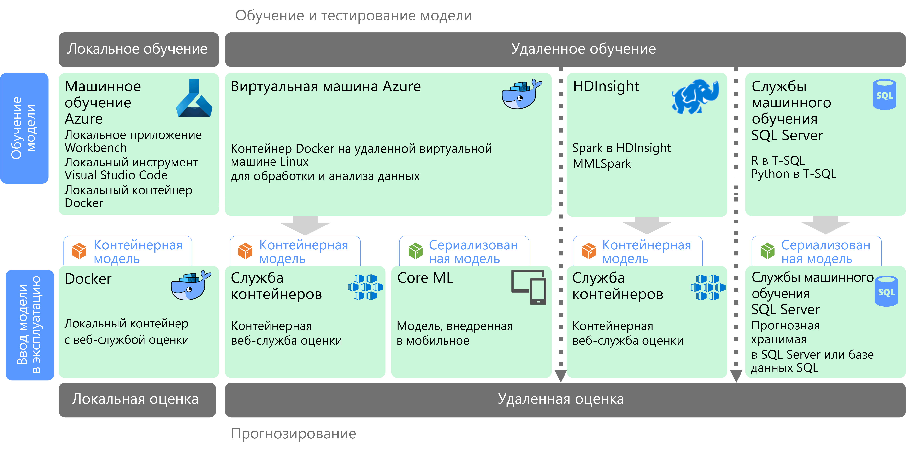

# Машинное обучение с поддержкой масштабирования

Машинное обучение (ML) — это метод обучения прогнозных моделей на основе математических алгоритмов. При машинном обучении анализируются связи между полями данных для прогнозирования неизвестных значений.

Создание и развертывание модели машинного обучения выполняется итеративно:

* Специалисты по обработке и анализу данных просматривают исходные данные и находят связи между *компонентами* и прогнозируемыми *метками*.
* Затем они обучают и проверяют модели на основе подходящих алгоритмов, стараясь определить оптимальную модель прогнозирования.
* Найденная оптимальная модель развертывается в рабочей среде в форме веб-службы или другой инкапсулированной функции.
* По мере сбора новых данных модель периодически проходит повторное обучение, что повышает ее эффективность.

Для поддержки масштабируемости в машинном обучении нужно решить две задачи. Во-первых, обучение модели по большим наборам данных требует высокой производительности и масштабируемости вычислительного кластера. Во-вторых, ввод модели в эксплуатацию должен допускать масштабирование в соответствии с требованиями приложений, в которых используется модель. Обычно для этого прогнозная функция развертывается в виде веб-службы, которую можно легко масштабировать.

Машинное обучение с поддержкой масштабирования обеспечивает мощные прогностические возможности, так как с увеличением объема данных модели совершенствуются. После обучения модели ее можно развернуть в виде высокопроизводительной и масштабируемой веб-службы без учета состояния. 

## Подготовка и обучение модели

На этапах подготовки и обучения модели специалисты по обработке и анализу данных интерактивно исследуют данные с помощью языков Python, R и др., чтобы достичь следующих целей:

* извлечь образцы из хранилищ данных большого объема;
* найти и устранить выбросы значений, дубликаты и пустые значения, то есть очистить данные;
* определить зависимости и связи данных с помощью статистического анализа и визуализаций;
* создать вычисляемые компоненты, повышающие прогнозируемость статистических связей;
* обучить модели машинного обучения на основе прогнозных алгоритмов;
* проверить обученные модели с использованием данных, не включенных в набор данных для обучения.

Чтобы упростить этап интерактивного анализа и моделирования, платформа данных должна предоставлять и поддерживать разнообразные средства для изучения данных. Кроме того, обучение комплексной модели машинного обучения требует крайне ресурсоемких вычислений для обработки больших объемов данных. Поэтому необходимо предоставить достаточный объем ресурсов для масштабирования процесса обучения.

## Развертывание и использование модели

Когда модель будет готова к развертыванию, ее можно инкапсулировать в веб-службу и развернуть в облаке, на пограничном устройстве или в корпоративной среде выполнения машинного обучения. Этот процесс развертывания называется вводом в эксплуатацию.

## Сложности

Машинное обучение с поддержкой масштабирования сопровождается несколькими сложностями:

- Для обучения модели часто требуется большой объем данных, особенно если это модель глубокого обучения.
- Эти большие наборы данных должны быть готовы до того, как вы сможете приступить к обучению.
- Этап обучения модели требует доступа к хранилищам больших данных. Обычно обучение модели выполняют на основе кластера больших данных (например, Spark), который используется для подготовки данных. 
- В некоторых ситуациях, например для глубокого обучения, необходимо использовать кластер, который поддерживает не только горизонтальное масштабирование процессоров, но и узлы с GPU.

## Машинное обучение с поддержкой масштабирования в Azure

Прежде чем выбирать службу машинного обучения для обучения модели и ее ввода в эксплуатацию, вам следует проанализировать потребность в таком обучении. Возможно, одна из готовых моделей полностью соответствует всем вашим требованиям. Часто для применения готовой модели достаточно настроить вызов веб-службы или загрузить модель с помощью библиотеки машинного обучения. Вот некоторые из доступных вариантов: 

- используйте веб-службы, предоставляемые Microsoft Cognitive Services;
- используйте предварительно обученные модели нейронных сетей, предоставляемые в Cognitive Toolkit;
- внедрите сериализованные модели, предоставляемые Core ML для приложений iOS. 

Если готовые модели не соответствуют особенностям ваших данных или сценария применения, примените одну из служб Azure: "Машинное обучение Azure", HDInsight с библиотеками Spark MLlib и MMLSpark, Cognitive Toolkit и "Службы машинного обучения SQL". Если вы решили использовать пользовательскую модель, разработайте конвейер для обучения модели и ее ввода в эксплуатацию. 

Список доступных в Azure технологий машинного обучения можно получить в следующих статьях:

- [Выбор технологии Microsoft Cognitive Services](../technology-choices/cognitive-services.md)
- [Выбор технологии машинного обучения в Azure](../technology-choices/data-science-and-machine-learning.md)
- [Выбор технологии обработки естественных языков в Azure](../technology-choices/natural-language-processing.md)
