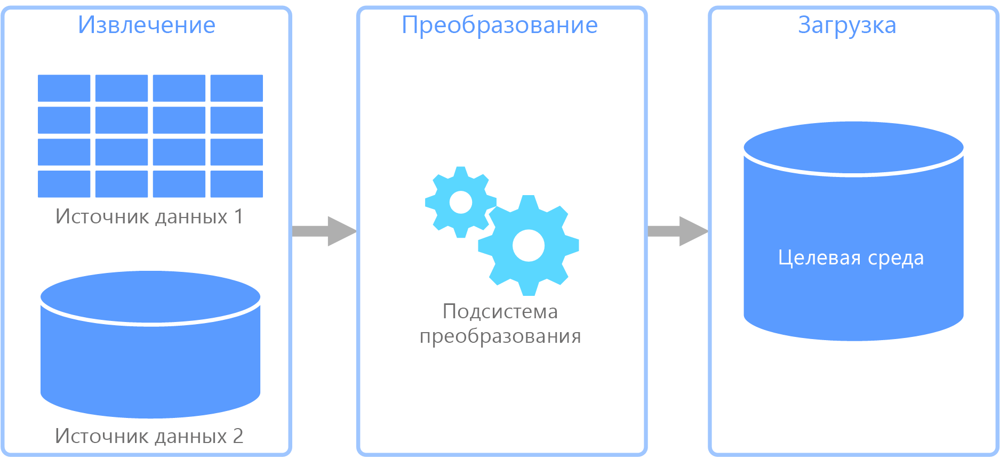
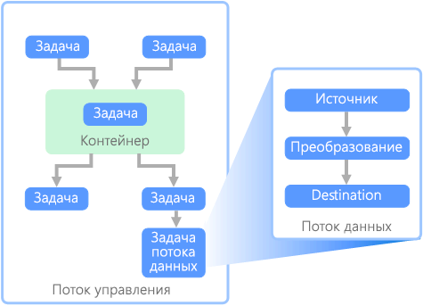

# Извлечение, преобразование и загрузка (ETL)

Распространенной проблемой, с которой сталкиваются организации, является сбор данных из нескольких источников в нескольких форматах и ​​перенос этих данных в одно или несколько хранилищ данных. Тип хранилища данных в целевой и исходной средах может отличаться, также как и формат. Иногда данные необходимо форматировать или очистить до загрузки в конечное расположение.

За несколько лет для решения этих проблем было разработано много средств, служб и процессов. Независимо от используемого процесса, существует общая потребность в координации работы и преобразовании данных в конвейере. В следующих разделах описываются распространенные методы, используемые для выполнения этих задач.

## Извлечение, преобразование и загрузка (ETL)

Извлечение, преобразование и загрузка (ETL) представляет собой конвейер данных, в рамках которого данные собираются из различных источников, преобразовываются в соответствии с бизнес-правилами и загружаются в целевое хранилище данных. Процесс преобразования в конвейере ETL выполняется в специальной подсистеме. Зачастую для временного хранения данных во время их преобразования и до загрузки в пункт назначения используются промежуточные таблицы.

Обычно в процессе преобразования данных применяются различные операции (например, фильтрация, сортировка, агрегирование, объединение, очистка, дедупликация и проверка данных).

Часто три этапа ETL выполняются параллельно, чтобы сэкономить время. Например, при извлечении данных процесс преобразования может уже обрабатывать полученные данные и подготавливать их для загрузки, а процесс загрузки может начать обрабатывать подготовленные данные, не дожидаясь полного завершения извлечения.

Соответствующие службы Azure:
- [Фабрика данных Azure версии 2](https://azure.microsoft.com/services/data-factory/).

Другие средства:
- [SQL Server Integration Services (SSIS)](/sql/integration-services/sql-server-integration-services)

## Извлечение, загрузка и преобразование (ELT)

Конвейер извлечения, загрузки и преобразования (ELT) отличается от ETL исключительно средой выполнения преобразования. В конвейере ELT преобразование происходит в целевом хранилище данных. В этом случае для преобразования данных вместо специальной подсистемы используются средства обработки целевого хранилища данных. Это упрощает архитектуру за счет удаления механизма преобразования из конвейера. Еще одним преимуществом этого подхода является то, что масштабирование целевого хранилища данных также улучшает производительность конвейера ELT. Тем не менее ELT работает надлежащим образом, только если целевая система имеет достаточную производительность для эффективного преобразования данных.

Обычно конвейер ELT применяется для обработки больших объемов данных. К примеру, вы можете извлечь все исходные данные в неструктурированные файлы в масштабируемое хранилище (например, распределенную файловую систему Hadoop (HDFS) или Azure Data Lake Store). Затем для выполнения запроса исходных данных можно использовать такие технологии, как Spark, Hive или PolyBase. Ключевой особенностью ELT является то, что хранилище данных, используемое для выполнения преобразования, — это то же хранилище, в котором данные в конечном счете потребляются. Это хранилище данных считывает данные непосредственно из масштабируемого хранилища, вместо того чтобы загружать их в собственное защищаемое хранилище. Этот подход пропускает этап копирования (присутствующий в ETL), который может занимать много времени при обработке больших наборов данных.

Обычно целевым хранилищем является [хранилище данных](./data-warehousing.md), использующее кластер Hadoop (с помощью Hive или Spark) или хранилище данных SQL. Чаще всего схема накладывается на данные неструктурированных файлов во время выполнения запроса и сохраняется в виде таблиц, позволяя запрашивать данные таким же образом, как и любую другую таблицу в хранилище данных. Они называются внешними таблицами, так как данные находятся не в хранилище, управляемом самим хранилищем данных, а во внешнем масштабируемом хранилище. 

Хранилище данных управляет только схемой данных и применяет ее при чтении. Например, кластер Hadoop, использующий Hive, описывает таблицу Hive, где источником данных является фактический путь к набору файлов в HDFS. В хранилище данных SQL технология PolyBase может достичь того же результата, создав таблицу с данными, хранящимися в самой базе данных. Когда исходные данные загружены, данные, имеющиеся во внешних таблицах, можно обрабатывать, используя возможности хранилища данных. В сценариях с большими данными это означает, что хранилище данных должно поддерживать массовую параллельную обработку (MPP), когда данные разбиваются на более мелкие фрагменты, а обработка этих фрагментов распределяется сразу между несколькими компьютерами в параллельном режиме.

Последний этап конвейера ELT обычно заключается в преобразовании исходных данных в окончательный формат, более эффективный для тех типов запросов, которые необходимо поддерживать. Например, данные могут быть секционированы. Кроме того, ELT может использовать оптимизированные форматы хранения (например, Parquet), в которых построчные данные хранятся в виде столбцов и предоставляется оптимизированная индексация. 

Соответствующие службы Azure:

- [Хранилище данных Azure SQL](/azure/sql-data-warehouse/sql-data-warehouse-overview-what-is)
- [HDInsight с Hive](/azure/hdinsight/hadoop/hdinsight-use-hive);
- [фабрика данных Azure версии 2](https://azure.microsoft.com/services/data-factory/);
- [Oozie в HDInsight](/azure/hdinsight/hdinsight-use-oozie-linux-mac).

Другие средства:

- [SQL Server Integration Services (SSIS)](/sql/integration-services/sql-server-integration-services)

## Поток данных и поток управления

В контексте конвейеров данных поток управления обеспечивает обработку набора задач в правильном порядке. Для этого используется управление очередностью. Эти ограничения можно рассматривать как соединители на схеме рабочего процесса, показанной ниже. Каждая задача имеет результат (успешное завершение, сбой или завершение). Все последующие задачи начинают обработку данных, только когда предыдущая задача завершена с одним из этих результатов.

Потоки управления выполняют потоки данных в качестве задачи. В рамках задачи потока данных данные извлекаются из источника, преобразовываются и загружаются в хранилище данных. Выходные данные одной задачи потока данных могут использоваться в качестве входных данных для следующей задачи потока данных, а эти потоки могут выполняться одновременно. В отличие от потоков управления, вы не можете добавить ограничения между задачами в потоке данных. Однако вы можете добавить средство просмотра данных для наблюдения за данными по мере их обрабатывания каждой задачей.

На приведенной выше схеме показано несколько задач в потоке управления, одна из которых является задачей потока данных. Одна из задач вложена в контейнер. Контейнеры можно использовать для обеспечения структуры задач, тем самым формируя единицу работы. Одним из примеров является повторение элементов в коллекции (например, файлы в папке или инструкции базы данных).

Соответствующие службы Azure:
- [Фабрика данных Azure версии 2](https://azure.microsoft.com/services/data-factory/).

Другие средства:
- [SQL Server Integration Services (SSIS)](/sql/integration-services/sql-server-integration-services)

## Выбор технологий

- [Хранилища данных оперативной обработки транзакций (OLTP)](./online-transaction-processing.md#oltp-in-azure)
- [Хранилища данных оперативной аналитической обработки (OLAP)](./online-analytical-processing.md#olap-in-azure)
- [Хранилища данных](./data-warehousing.md)
- [Оркестрация конвейеров](../technology-choices/pipeline-orchestration-data-movement.md)

## Дополнительная информация

На следующей схеме эталонной архитектуры представлены сквозные конвейеры ELT в Azure:

- [Корпоративная бизнес-аналитика в Azure с использованием Хранилища данных SQL](../../reference-architectures/data/enterprise-bi-sqldw.md)
- [Автоматизированная корпоративная бизнес-аналитика с использованием Хранилища данных SQL и Фабрики данных Azure](../../reference-architectures/data/enterprise-bi-adf.md)