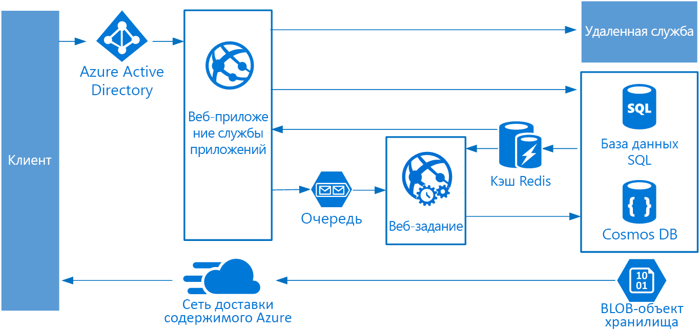

# Стиль архитектуры "Интерфейс — очередь — рабочая роль"

Основными компонентами этой архитектуры являются **веб-интерфейс** для обслуживания клиентских запросов и **рабочая роль** для выполнения ресурсоемких задач, долгосрочных рабочих процессов или пакетных заданий.  Веб-интерфейс взаимодействует с рабочей ролью через **очередь сообщений**.

Также в эту архитектуру часто включают другие компоненты, в том числе:

- одну или несколько баз данных;
- кэш для хранения значений из базы данных для быстрого чтения;
- сеть доставки содержимого, которая обслуживает статическое содержимое;
- удаленные службы, например служба электронной почты или текстовых сообщений (часто это службы сторонних производителей);
- поставщик удостоверений для аутентификации.

Веб-интерфейс и рабочая роль реализованы без отслеживания состояния. Сведения о состоянии сеанса можно сохранять в распределенном кэше. Любые длительные задачи выполняются рабочей ролью в асинхронном режиме. Рабочая роль запускается при помещении сообщений в очередь или по расписанию для пакетной обработки. Рабочая роль используется не всегда. Если длительные операции не требуются, ее можно не вызывать.

Внешний интерфейс может быть реализован как веб-API. На стороне клиента веб-API представлен в виде одностраничного приложения, в котором выполняются вызовы через AJAX, или собственного клиентского приложения.

## Когда следует использовать эту архитектуру

Архитектура "Интерфейс — очередь — рабочая роль" обычно реализуется на основе управляемых вычислительных служб, таких как служба приложений Azure или облачные службы Azure.

Используйте эту архитектуру для следующих сценариев:

- приложения с относительно несложными функциями;
- приложения, в которых выполняются долгосрочные процессы или пакетные операции;
- если нужно применить управляемые службы вместо решений IaaS (инфраструктура как услуга).

## Преимущества

- Это несложная и удобная архитектура.
- Она проста в развертывании и управлении.
- Четко разделены зоны ответственности.
- Внешний интерфейс отделен от рабочей роли благодаря механизму асинхронного обмена сообщениями.
- Внешний интерфейс и рабочую роль можно масштабировать независимо друг от друга.

## Сложности

- К разработке нужно подходить внимательно, иначе внешний интерфейс и (или) рабочая роль могут стать громоздкими и монолитными компонентами, которые трудно обслуживать и обновлять.
- Если во внешнем интерфейсе и рабочей роли используются общие схемы данных или модули, могут возникнуть скрытые зависимости.

## Рекомендации

- Предоставлять клиенту хорошо спроектированный API-интерфейс. См. [рекомендации по проектированию API][api-design].
- Автоматически масштабировать систему с учетом изменений нагрузки. См. [рекомендации по автомасштабированию][autoscaling].
- Кэшировать данные с признаками статических. См. [рекомендации по кэшированию][caching].
- Использовать сеть доставки содержимого для размещения статического содержимого. См. [рекомендации по использованию CDN][cdn].
- При возможности использовать Polyglot Persistence. См. статью об [использовании подходящего хранилища данных для задания][polyglot].
- Секционировать данные, чтобы улучшить масштабируемость, уменьшить количество конфликтов и оптимизировать производительность. См. [рекомендации по секционированию данных][data-partition].

## Модель "Интерфейс — очередь — рабочая роль" в службе приложений Azure

В этом разделе описана рекомендуемая архитектура "Интерфейс — очередь — рабочая роль" для службы приложений Azure.

Внешний интерфейс реализуется в виде веб-приложения службы приложений Azure, а рабочая роль — как веб-задание. Эти веб-приложение и веб-задание сопоставляются с планом службы приложений, который предоставляет экземпляры виртуальных машин.

В качестве очереди сообщений можно применить очередь служебной шины Azure или очередь службы хранилища Azure. (На схеме представлена очередь службы хранилища Azure.)

В кэше Redis для Azure хранятся сведения о состоянии сеанса и другие данные, к которым нужен доступ с низкой задержкой.

Azure CDN кэширует статическое содержимое, например изображения, документы HTML и CSS.

Для хранения данных вы можете выбрать любую технологию, соответствующую требованиям приложения. Можно одновременно использовать несколько технологий хранения данных (Polyglot Persistence). Эта концепция отражена на схеме в виде блоков службы "База данных SQL Azure" и Azure Cosmos DB.

Дополнительные сведения см. в [описании базовой архитектуры для веб-приложения в службе приложений][scalable-web-app].

### Дополнительные замечания

- Не все транзакции передаются в хранилище через очередь и рабочую роль. Простые операции чтения и (или) записи веб-интерфейс может выполнять напрямую. Рабочие роли предназначены только для ресурсоемких задач или долго выполняющихся рабочих процессов. В некоторых сценариях рабочая роль не нужна.

- Встроенная в службу приложений функция автоматического масштабирования позволяет изменять количество экземпляров виртуальных машин. При четко прогнозируемой нагрузке на приложение используйте автоматическое масштабирование на основе расписания. Если нагрузка непредсказуема, используйте правила автоматического масштабирования на основе метрик.

- Возможно, веб-приложение и веб-задание стоит разместить в разных планах службы приложений. Тогда они будут выполняться на разных экземплярах виртуальных машин и вы сможете масштабировать их независимо друг от друга.

- Используйте разные планы службы приложений для рабочей и тестовой сред. Если у вас будет общий план для рабочей среды и тестирования, все задачи тестирования будут выполняться прямо на виртуальных машинах рабочей среды.

- Для управления развертываниями используйте слоты развертывания. Это позволит развернуть обновленную версию в промежуточном слоте, а затем переключить на нее рабочий слот. Кроме того, вы сможете легко вернуться к предыдущей версии, если возникнет проблема с обновлением.

<!-- links -->

[api-design]: ../../best-practices/api-design.md
[autoscaling]: ../../best-practices/auto-scaling.md
[caching]: ../../best-practices/caching.md
[cdn]: ../../best-practices/cdn.md
[data-partition]: ../../best-practices/data-partitioning.md
[polyglot]: ../design-principles/use-the-best-data-store.md
[scalable-web-app]: ../../reference-architectures/app-service-web-app/scalable-web-app.md