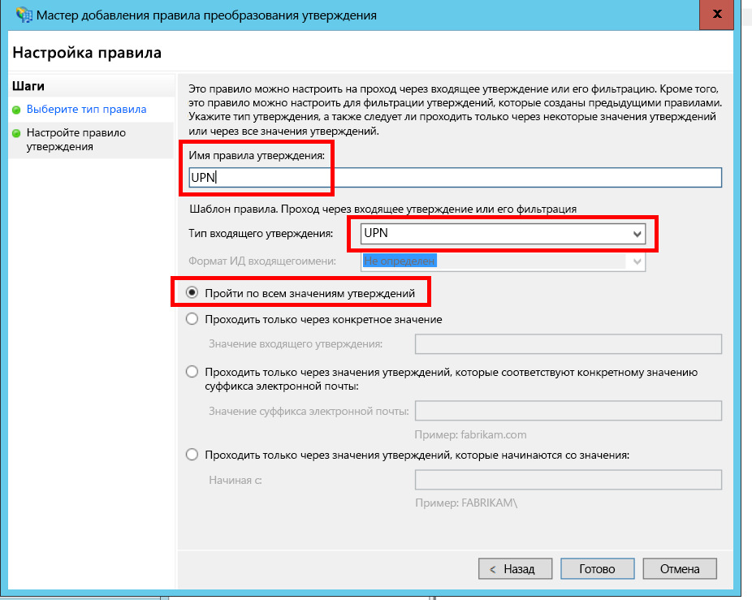
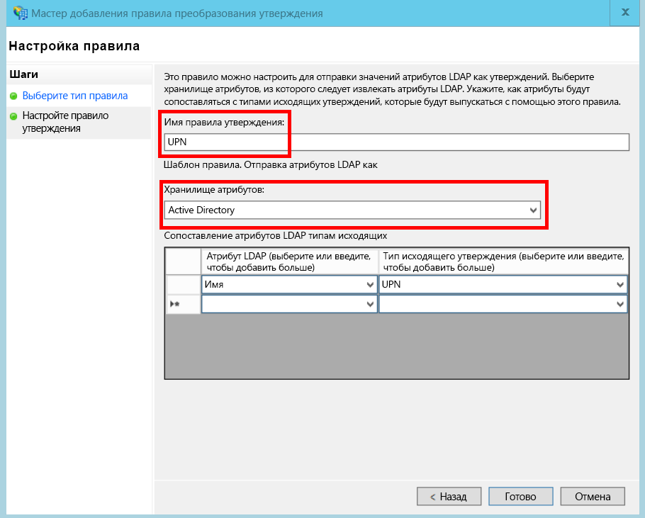

# <a name="federate-with-a-customers-ad-fs"></a>Федерация с клиентской службой AD FS

В этой статье описывается, каким образом мультитенантное приложение SaaS поддерживает проверку подлинности через службы федерации Active Directory (AD FS) для создания федерации со службой AD FS клиента.

## <a name="overview"></a>Обзор
Azure Active Directory (Azure AD) упрощает процесс входа пользователей из клиентов Azure AD, включая клиентов Office 365 и Dynamics CRM Online. Но как быть с пользователями, использующими локальную службу Active Directory в корпоративной интрасети?

Одним из вариантов для таких пользователей является синхронизация локальной службы AD с Azure AD с помощью [Azure AD Connect]. Но, возможно, некоторым клиентам не удастся реализовать этот подход ввиду особенностей корпоративной ИТ-политики или по другим причинам. В этом случае следует рассмотреть другой вариант — создание федерации с помощью служб федерации Active Directory (AD FS).

Чтобы реализовать этот сценарий, необходимо выполнить приведенные ниже условия.

* У клиента должна быть доступная через Интернет ферма AD FS.
* Поставщик SaaS развертывает собственную ферму AD FS.
* Клиент и поставщик SaaS должны установить [доверие федерации]. Этот процесс выполняется в ручную.

В отношении доверия существуют три основные роли.

* AD FS клиента является [партнером по учетным записям], отвечающим за проверку подлинности пользователей в службе AD клиента и за создание маркеров безопасности с утверждениями пользователей.
* AD FS поставщика SaaS является [партнером по ресурсам], который доверяет партнеру по учетным записям и получает утверждения пользователей.
* Приложение настроено в качестве проверяющей стороны (RP) в службе AD FS поставщика SaaS.
  
  

> [!NOTE]
> В этой статье предполагается, что в качестве протокола проверки подлинности приложение использует OpenID Connect. Другим вариантом является использование WS-Federation.
> 
> Чтобы использовать OpenID Connect, поставщик SaaS должен работать с AD FS 2016 под управлением Windows Server 2016. AD FS 3.0 не поддерживает OpenID Connect.
> 
> В ASP.NET Core не предусмотрена встроенная поддержка WS-Federation.
> 
> 

Пример использования WS-Federation для ASP.NET 4 вы найдете на странице GitHub [active-directory-dotnet-webapp-wsfederation][active-directory-dotnet-webapp-wsfederation].

## <a name="authentication-flow"></a>Поток проверки подлинности
1. Когда пользователь нажимает кнопку входа, приложение выполняет перенаправление в конечную точку OpenID Connect в службе AD FS поставщика SaaS.
2. Пользователь вводит имя пользователя организации ("`alice@corp.contoso.com`"). AD FS использует обнаружение домашней области для перенаправления в службу AD FS клиента, где пользователь вводит свои учетные данные.
3. AD FS клиента отправляет утверждения пользователя в AD FS поставщика SaaS с помощью WF-Federation (или SAML).
4. Утверждения отправляются из AD FS в приложение с помощью OpenID Connect. Для этого необходимо сменить протокол WS-Federation.

## <a name="limitations"></a>Ограничения
По умолчанию приложение проверяющей стороны получает через id_token только фиксированный набор утверждений, которые перечислены в приведенной ниже таблице. В AD FS 2016 вы можете настроить id_token для сценариев OpenID Connect. Дополнительные сведения см. в разделе [Custom ID Tokens in AD FS](/windows-server/identity/ad-fs/development/customize-id-token-ad-fs-2016) (Пользовательские маркеры идентификаторов в Azure AD FS).

| Утверждение | Описание |
| --- | --- |
| aud |Аудитория. Это приложение, для которого выданы утверждения. |
| authenticationinstant |[Время выполнения аутентификации.] Время, когда происходила аутентификация. |
| c_hash |Значение хэш-кода. Это хэш содержимого маркера. |
| exp |[Время окончания срока действия.] После наступления этого момента маркер больше не будет приниматься. |
| iat |Время выдачи. Это время, когда был выдан маркер. |
| iss |Издатель. Значение этого утверждения всегда указывает на AD FS партнера по ресурсам. |
| name |Имя пользователя. Пример: `john@corp.fabrikam.com`. |
| nameidentifier |[Идентификатор имени.] Идентификатор имени сущности, для которой был выдан маркер. |
| nonce |Специальное утверждение сеанса. Уникальное значение, которое AD FS создает для защиты от атак с повторением пакетов. |
| upn |Имя участника-пользователя (UPN). Пример: john@corp.fabrikam.com |
| pwd_exp |Период до истечения срока действия пароля. Время в секундах, оставшееся до окончания срока действия для пароля пользователя или аналогичного секрета аутентификации, например ПИН-кода. |

> [!NOTE]
> Утверждение "iss" указывает на AD FS партнера (как правило, это утверждение определяет поставщика SaaS у этого издателя). Оно не имеет отношения к AD FS клиента. Домен клиента вы можете извлечь из имени участника-пользователя.
> 
> 

Далее в этой статье описывается процедура установки отношения доверия между RP (приложением) и партнером по учетным записям (клиентом).

## <a name="ad-fs-deployment"></a>Развертывание AD FS
Поставщик SaaS может развернуть AD FS локально или на виртуальных машинах Azure. В целях обеспечения безопасности и доступности важно учесть приведенные далее рекомендации.

* Для обеспечения максимальной доступности службы AD FS следует развернуть по меньшей мере два сервера AD FS и два прокси-сервера AD FS.
* Контроллеры домена и серверы AD FS нельзя предоставлять для прямого доступа из Интернета. Их следует разместить в виртуальной сети с прямым доступом к ним.
* Для публикации серверов AD FS в Интернете необходимо использовать прокси-службы веб-приложений (ранее — прокси AD FS).

Чтобы настроить такую топологию в Azure, нужно применить виртуальные сети, группы безопасности сети, виртуальные машины Azure и группы доступности. См. [рекомендации по развертыванию Windows Server Active Directory на виртуальных машинах Azure][active-directory-on-azure].

## <a name="configure-openid-connect-authentication-with-ad-fs"></a>Настройка аутентификации OpenID Connect в AD FS
Поставщик SaaS должен включить OpenID Connect между приложением и AD FS. Для этого нужно добавить группу приложений в AD FS.  Подробные инструкции можно найти в этой [записи блога]в разделе "Настройка веб-приложения для входа OpenId Connect в AD FS". 

Теперь настройте ПО промежуточного слоя OpenID Connect. Конечной точкой метаданных является `https://domain/adfs/.well-known/openid-configuration`, где домен представляет собой домен AD FS поставщика SaaS.

Как правило, эту точку можно объединять с другими конечными точками OpenID Connect (например AAD). Чтобы различать эти точки и отправлять пользователя в нужную конечную точку проверки подлинности, потребуется две разные кнопки входа или какой-либо другой способ определения соответствующей точки.

## <a name="configure-the-ad-fs-resource-partner"></a>Настройка партнера по ресурсам AD FS
Поставщик SaaS должен выполнить приведенные далее действия для каждого клиента, который хочет подключаться через ADFS.

1. Добавление отношения доверия поставщика утверждений.
2. Добавление правил утверждений.
3. Включение обнаружения домашней области.

Ниже приведено более подробное описание этих шагов.

### <a name="add-the-claims-provider-trust"></a>Добавление отношения доверия поставщика утверждений
1. В диспетчере сервера щелкните **Средства** и выберите **Управление AD FS**.
2. В дереве консоли в области **AD FS** щелкните правой кнопкой мыши **Отношения доверия поставщиков утверждений**. Выберите **Добавить отношение доверия поставщика утверждений**.
3. Щелкните **Запустить** , чтобы запустить мастер.
4. Выберите параметр "Импорт данных о поставщике утверждений, опубликованных в Интернете или локальной сети". Введите URI конечной точки метаданных федерации, предоставленной поставщиком SaaS. (Например: `https://contoso.com/FederationMetadata/2007-06/FederationMetadata.xml`.) Эти данные следует получить у клиента.
5. Завершите работу мастера, оставив значения по умолчанию.

### <a name="edit-claims-rules"></a>Изменение правил утверждений
1. Щелкните правой кнопкой мыши только что добавленное отношение доверия поставщика утверждений и выберите команду **Изменить правила утверждений**.
2. Щелкните **Добавить правило**.
3. Выберите "Проход через входящее утверждение или его фильтрация" и щелкните **Далее**.
   
4. Введите имя правила.
5. В поле "Тип входящего утверждения" выберите **UPN**.
6. Выберите "Пропускать все значения утверждений".
   
7. Нажмите кнопку **Готово**
8. Повторите шаги 2–7 и укажите **Тип утверждения привязки** для типа входящего утверждения.
9. Нажмите кнопку **ОК** , чтобы завершить работу мастера.

### <a name="enable-home-realm-discovery"></a>Включение обнаружения домашней области
Выполните следующий сценарий PowerShell:

```
Set-ADFSClaimsProviderTrust -TargetName "name" -OrganizationalAccountSuffix @("suffix")
```

где "name" — понятное имя доверия поставщика утверждений, а "suffix" — суффикс UPN для AD клиента (например "corp.fabrikam.com").

Эта конфигурация позволяет пользователям вводить данные рабочей учетной записи, для которой AD FS автоматически выберет соответствующий поставщик утверждений. См. статью о [настройке страниц входа в AD FS] и раздел "Настройка поставщика удостоверений для использования определенных суффиксов электронной почты".

## <a name="configure-the-ad-fs-account-partner"></a>Настройка партнера по учетным записям AD FS
Клиент должен выполнить приведенные ниже действия.

1. Добавление отношение доверия с проверяющей стороной (RP).
2. Добавление правил утверждений.

### <a name="add-the-rp-trust"></a>Добавление отношения доверия с проверяющей стороной
1. В диспетчере сервера щелкните **Средства** и выберите **Управление AD FS**.
2. В дереве консоли в области **AD FS** щелкните правой кнопкой мыши **Отношения доверия проверяющей стороны**. Выберите **Добавить отношение доверия с проверяющей стороной**.
3. Выберите **Поддерживающие утверждения** и щелкните **Запустить**.
4. На странице **Выбор источника данных** выберите параметр "Импорт данных о поставщике утверждений, опубликованных в Интернете или локальной сети". Введите URI конечной точки метаданных федерации поставщика SaaS.
   
5. На странице **Указание отображаемого имени** введите любое имя.
6. На странице **Выбор политики управления доступом** выберите политику. Можно выбрать всех пользователей в организации или определенную группу безопасности.
   
7. Укажите все необходимые параметры в поле **Политика**.
8. Чтобы завершить работу мастера, нажмите кнопку **Далее** .

### <a name="add-claims-rules"></a>Добавление правил утверждений
1. Щелкните правой кнопкой мыши добавленное отношение доверия с проверяющей стороной, а затем выберите команду **Изменить политику выдачи утверждений**.
2. Щелкните **Добавить правило**.
3. Выберите "Отправка атрибутов LDAP в виде утверждений" и нажмите кнопку **Далее**.
4. Введите имя правила, например "UPN".
5. Для параметра **Хранилище атрибутов** выберите значение **Active Directory**.
   
6. В разделе **Сопоставление атрибутов LDAP** :
   * Для параметра **Атрибут LDAP** выберите значение **Имя участника-пользователя**.
   * В поле **Тип исходящего утверждения** выберите **UPN**.
     
7. Нажмите кнопку **Готово**
8. Щелкните **Добавить правило** еще раз.
9. Выберите "Отправлять утверждения с помощью настраиваемого правила" и нажмите кнопку **Далее**.
10. Введите имя этого правила, например "Anchor Claim Type" (Тип утверждения привязки).
11. В разделе **Настраиваемое правило**введите приведенный ниже код.
    
    ```
    EXISTS([Type == "http://schemas.microsoft.com/ws/2014/01/identity/claims/anchorclaimtype"])=>
    issue (Type = "http://schemas.microsoft.com/ws/2014/01/identity/claims/anchorclaimtype",
          Value = "http://schemas.xmlsoap.org/ws/2005/05/identity/claims/upn");
    ```
    
    Это правило выдает утверждение типа `anchorclaimtype`. Такое утверждение указывает проверяющей стороне, что в качестве неизменяемого идентификатора пользователя нужно использовать имя участника-пользователя.
12. Нажмите кнопку **Готово**
13. Нажмите кнопку **ОК** , чтобы завершить работу мастера.


<!-- Links -->
[Azure AD Connect]: /azure/active-directory/active-directory-aadconnect/
[доверие федерации]: https://technet.microsoft.com/library/cc770993(v=ws.11).aspx
[партнером по учетным записям]: https://technet.microsoft.com/library/cc731141(v=ws.11).aspx
[партнером по ресурсам]: https://technet.microsoft.com/library/cc731141(v=ws.11).aspx
[Время выполнения аутентификации.]: https://msdn.microsoft.com/library/system.security.claims.claimtypes.authenticationinstant%28v=vs.110%29.aspx
[Время окончания срока действия.]: http://tools.ietf.org/html/draft-ietf-oauth-json-web-token-25#section-4.1.
[Идентификатор имени.]: https://msdn.microsoft.com/library/system.security.claims.claimtypes.nameidentifier(v=vs.110).aspx
[active-directory-on-azure]: https://msdn.microsoft.com/library/azure/jj156090.aspx
[записи блога]: http://www.cloudidentity.com/blog/2015/08/21/OPENID-CONNECT-WEB-SIGN-ON-WITH-ADFS-IN-WINDOWS-SERVER-2016-TP3/
[настройке страниц входа в AD FS]: https://technet.microsoft.com/library/dn280950.aspx
[sample application]: https://github.com/mspnp/multitenant-saas-guidance
[client assertion]: client-assertion.md
[active-directory-dotnet-webapp-wsfederation]: https://github.com/Azure-Samples/active-directory-dotnet-webapp-wsfederation
