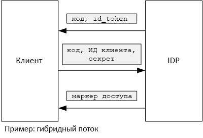

# <a name="use-client-assertion-to-get-access-tokens-from-azure-ad"></a><span data-ttu-id="935b2-103">Получение маркеров доступа из Azure AD с помощью утверждений клиентов</span><span class="sxs-lookup"><span data-stu-id="935b2-103">Use client assertion to get access tokens from Azure AD</span></span>

<span data-ttu-id="935b2-104">[ Пример кода][sample application]</span><span class="sxs-lookup"><span data-stu-id="935b2-104">[ Sample code][sample application]</span></span>

## <a name="background"></a><span data-ttu-id="935b2-105">Фоновый</span><span class="sxs-lookup"><span data-stu-id="935b2-105">Background</span></span>
<span data-ttu-id="935b2-106">При использовании потока кода авторизации или гибридного потока в OpenID Connect клиент обменивается кодом авторизации для маркера доступа.</span><span class="sxs-lookup"><span data-stu-id="935b2-106">When using authorization code flow or hybrid flow in OpenID Connect, the client exchanges an authorization code for an access token.</span></span> <span data-ttu-id="935b2-107">На этом этапе клиент должен пройти проверку подлинности на сервере.</span><span class="sxs-lookup"><span data-stu-id="935b2-107">During this step, the client has to authenticate itself to the server.</span></span>



<span data-ttu-id="935b2-109">Один из способов проверки подлинности клиента заключается в использовании секрета клиента.</span><span class="sxs-lookup"><span data-stu-id="935b2-109">One way to authenticate the client is by using a client secret.</span></span> <span data-ttu-id="935b2-110">Вот как приложение [Tailspin Surveys][Surveys] настроено по умолчанию.</span><span class="sxs-lookup"><span data-stu-id="935b2-110">That's how the [Tailspin Surveys][Surveys] application is configured by default.</span></span>

<span data-ttu-id="935b2-111">Ниже приведен пример запроса клиента на маркер доступа от поставщика удостоверений.</span><span class="sxs-lookup"><span data-stu-id="935b2-111">Here is an example request from the client to the IDP, requesting an access token.</span></span> <span data-ttu-id="935b2-112">Обратите внимание на параметр `client_secret` .</span><span class="sxs-lookup"><span data-stu-id="935b2-112">Note the `client_secret` parameter.</span></span>

```
POST https://login.microsoftonline.com/b9bd2162xxx/oauth2/token HTTP/1.1
Content-Type: application/x-www-form-urlencoded

resource=https://tailspin.onmicrosoft.com/surveys.webapi
  &client_id=87df91dc-63de-4765-8701-b59cc8bd9e11
  &client_secret=i3Bf12Dn...
  &grant_type=authorization_code
  &code=PG8wJG6Y...
```

<span data-ttu-id="935b2-113">Секрет представляет собой просто строку, поэтому необходимо защитить его от раскрытия.</span><span class="sxs-lookup"><span data-stu-id="935b2-113">The secret is just a string, so you have to make sure not to leak the value.</span></span> <span data-ttu-id="935b2-114">Секрет клиента рекомендуется хранить вне системы управления версиями.</span><span class="sxs-lookup"><span data-stu-id="935b2-114">The best practice is to keep the client secret out of source control.</span></span> <span data-ttu-id="935b2-115">При развертывании в Azure храните секрет клиента в [параметрах приложения][configure-web-app].</span><span class="sxs-lookup"><span data-stu-id="935b2-115">When you deploy to Azure, store the secret in an [app setting][configure-web-app].</span></span>

<span data-ttu-id="935b2-116">Однако все, кто имеет доступ к подписке Azure, могут просматривать параметры приложения.</span><span class="sxs-lookup"><span data-stu-id="935b2-116">However, anyone with access to the Azure subscription can view the app settings.</span></span> <span data-ttu-id="935b2-117">Кроме того, всегда есть возможность проверить секретные данные в системе управления версиями (например, в сценарии развертывания), отправить их по электронной почте и т. д.</span><span class="sxs-lookup"><span data-stu-id="935b2-117">Further, there is always a temptation to check secrets into source control (e.g., in deployment scripts), share them by email, and so on.</span></span>

<span data-ttu-id="935b2-118">Для обеспечения дополнительной безопасности вместо секрета клиента можно использовать [утверждение клиента].</span><span class="sxs-lookup"><span data-stu-id="935b2-118">For additional security, you can use [client assertion] instead of a client secret.</span></span> <span data-ttu-id="935b2-119">При наличии утверждения клиент использует сертификат X.509 для доказательства получения запроса на маркер от клиента.</span><span class="sxs-lookup"><span data-stu-id="935b2-119">With client assertion, the client uses an X.509 certificate to prove the token request came from the client.</span></span> <span data-ttu-id="935b2-120">Сертификат клиента установлен на веб-сервере.</span><span class="sxs-lookup"><span data-stu-id="935b2-120">The client certificate is installed on the web server.</span></span> <span data-ttu-id="935b2-121">Как правило, будет проще ограничить доступ к сертификату, чем предотвратить непреднамеренное раскрытие секрета клиента.</span><span class="sxs-lookup"><span data-stu-id="935b2-121">Generally, it will be easier to restrict access to the certificate, than to ensure that nobody inadvertently reveals a client secret.</span></span> <span data-ttu-id="935b2-122">Дополнительные сведения о настройке сертификатов в веб-приложении см. в статье [Using Certificates in Azure Websites Applications][using-certs-in-websites] (Использование сертификатов в приложениях веб-сайтов Azure).</span><span class="sxs-lookup"><span data-stu-id="935b2-122">For more information about configuring certificates in a web app, see [Using Certificates in Azure Websites Applications][using-certs-in-websites]</span></span>

<span data-ttu-id="935b2-123">Ниже приведен запрос на маркер с помощью утверждения клиента.</span><span class="sxs-lookup"><span data-stu-id="935b2-123">Here is a token request using client assertion:</span></span>

```
POST https://login.microsoftonline.com/b9bd2162xxx/oauth2/token HTTP/1.1
Content-Type: application/x-www-form-urlencoded

resource=https://tailspin.onmicrosoft.com/surveys.webapi
  &client_id=87df91dc-63de-4765-8701-b59cc8bd9e11
  &client_assertion_type=urn:ietf:params:oauth:client-assertion-type:jwt-bearer
  &client_assertion=eyJhbGci...
  &grant_type=authorization_code
  &code= PG8wJG6Y...
```

<span data-ttu-id="935b2-124">Обратите внимание, что параметр `client_secret` больше не используется.</span><span class="sxs-lookup"><span data-stu-id="935b2-124">Notice that the `client_secret` parameter is no longer used.</span></span> <span data-ttu-id="935b2-125">Параметр `client_assertion` содержит маркер JWT, который был подписан с помощью сертификата клиента.</span><span class="sxs-lookup"><span data-stu-id="935b2-125">Instead, the `client_assertion` parameter contains a JWT token that was signed using the client certificate.</span></span> <span data-ttu-id="935b2-126">Параметр `client_assertion_type` указывает тип утверждения, в этом случае &mdash; токен JWT.</span><span class="sxs-lookup"><span data-stu-id="935b2-126">The `client_assertion_type` parameter specifies the type of assertion &mdash; in this case, JWT token.</span></span> <span data-ttu-id="935b2-127">Сервер проверяет маркер JWT.</span><span class="sxs-lookup"><span data-stu-id="935b2-127">The server validates the JWT token.</span></span> <span data-ttu-id="935b2-128">Если маркер JWT является недопустимым, запрос на маркер возвращает ошибку.</span><span class="sxs-lookup"><span data-stu-id="935b2-128">If the JWT token is invalid, the token request returns an error.</span></span>

> [!NOTE]
> <span data-ttu-id="935b2-129">Сертификаты X.509 не являются единственной формой утверждения клиента. Но мы сосредоточимся на этом, так как сертификаты X.509 поддерживаются службой Azure AD.</span><span class="sxs-lookup"><span data-stu-id="935b2-129">X.509 certificates are not the only form of client assertion; we focus on it here because it is supported by Azure AD.</span></span>
> 
> 

<span data-ttu-id="935b2-130">Во время выполнения веб-приложение считывает сертификат из хранилища сертификатов.</span><span class="sxs-lookup"><span data-stu-id="935b2-130">At run time, the web application reads the certificate from the certificate store.</span></span> <span data-ttu-id="935b2-131">Сертификат должен быть установлен на одном компьютере с веб-приложением.</span><span class="sxs-lookup"><span data-stu-id="935b2-131">The certificate must be installed on the same machine as the web app.</span></span>

<span data-ttu-id="935b2-132">В приложении Surveys есть вспомогательный класс, который создает [ClientAssertionCertificate](/dotnet/api/microsoft.identitymodel.clients.activedirectory.clientassertioncertificate), передаваемый в метод [AuthenticationContext.AcquireTokenSilentAsync](/dotnet/api/microsoft.identitymodel.clients.activedirectory.authenticationcontext.acquiretokensilentasync) для получения токена из Azure AD.</span><span class="sxs-lookup"><span data-stu-id="935b2-132">The Surveys application includes a helper class that creates a [ClientAssertionCertificate](/dotnet/api/microsoft.identitymodel.clients.activedirectory.clientassertioncertificate) that you can pass to the [AuthenticationContext.AcquireTokenSilentAsync](/dotnet/api/microsoft.identitymodel.clients.activedirectory.authenticationcontext.acquiretokensilentasync) method to acquire a token from Azure AD.</span></span>

```csharp
public class CertificateCredentialService : ICredentialService
{
    private Lazy<Task<AdalCredential>> _credential;

    public CertificateCredentialService(IOptions<ConfigurationOptions> options)
    {
        var aadOptions = options.Value?.AzureAd;
        _credential = new Lazy<Task<AdalCredential>>(() =>
        {
            X509Certificate2 cert = CertificateUtility.FindCertificateByThumbprint(
                aadOptions.Asymmetric.StoreName,
                aadOptions.Asymmetric.StoreLocation,
                aadOptions.Asymmetric.CertificateThumbprint,
                aadOptions.Asymmetric.ValidationRequired);
            string password = null;
            var certBytes = CertificateUtility.ExportCertificateWithPrivateKey(cert, out password);
            return Task.FromResult(new AdalCredential(new ClientAssertionCertificate(aadOptions.ClientId, new X509Certificate2(certBytes, password))));
        });
    }

    public async Task<AdalCredential> GetCredentialsAsync()
    {
        return await _credential.Value;
    }
}
```

<span data-ttu-id="935b2-133">Сведения о настройке клиентских утверждений в приложении Surveys см. в статье [Use Azure Key Vault to protect application secrets][key vault] (Использование хранилища Azure Key Vault для защиты секретов приложения).</span><span class="sxs-lookup"><span data-stu-id="935b2-133">For information about setting up client assertion in the Surveys application, see [Use Azure Key Vault to protect application secrets ][key vault].</span></span>

<span data-ttu-id="935b2-134">[**Далее**][key vault]</span><span class="sxs-lookup"><span data-stu-id="935b2-134">[**Next**][key vault]</span></span>

<!-- Links -->
[configure-web-app]: /azure/app-service-web/web-sites-configure/
[azure-management-portal]: https://portal.azure.com
[утверждение клиента]: https://tools.ietf.org/html/rfc7521
[key vault]: key-vault.md
[Setup-KeyVault]: https://github.com/mspnp/multitenant-saas-guidance/blob/master/scripts/Setup-KeyVault.ps1
[Surveys]: tailspin.md
[using-certs-in-websites]: https://azure.microsoft.com/blog/using-certificates-in-azure-websites-applications/

[sample application]: https://github.com/mspnp/multitenant-saas-guidance
