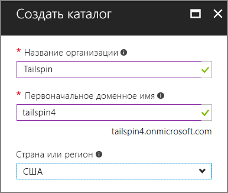
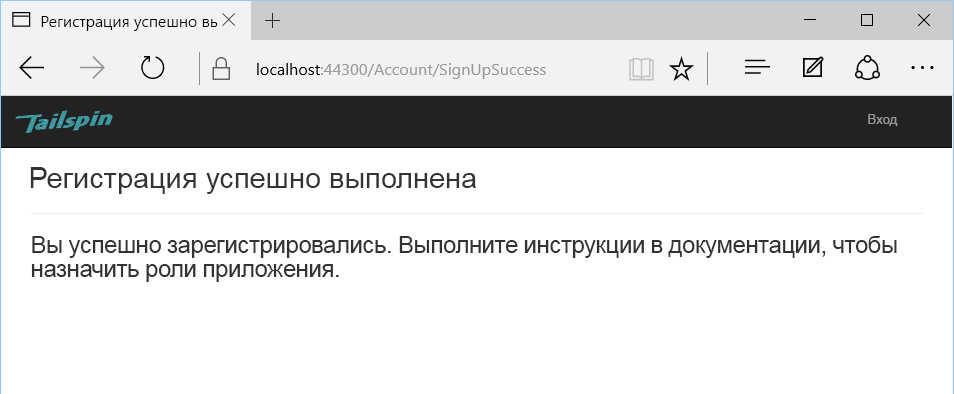
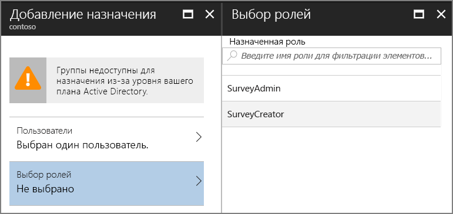

# <a name="run-the-surveys-application"></a>Запуск приложения Surveys

В этой статье объясняется, как запустить приложение [Tailspin Surveys](./tailspin.md) локально с помощью Visual Studio. В этом пошаговом руководстве вы не будете развертывать приложение в Azure. Но вам потребуется создать некоторые ресурсы Azure &mdash; каталог Azure Active Directory (Azure AD) и кэш Redis.

Вот краткий перечень шагов:

1. Создание каталога (клиента) Azure AD для вымышленной компании Tailspin.
2. Регистрация приложения Surveys и серверного веб-API с помощью Azure AD.
3. Создание экземпляра кэша Redis для Azure.
4. Настройка параметров приложения и создание локальной базы данных.
5. Запуск приложения и регистрация нового клиента.
6. Добавление ролей приложения для пользователей.

## <a name="prerequisites"></a>Предварительные требования

- [Visual Studio 2017][VS2017] с установленной[рабочей нагрузкой веб-разработки и ASP.NET](https://visualstudio.microsoft.com/vs/support/selecting-workloads-visual-studio-2017).
- Учетная запись [Microsoft Azure](https://azure.microsoft.com).

## <a name="create-the-tailspin-tenant"></a>Создание клиента Tailspin

Tailspin — это вымышленная компания, которая размещает приложение Surveys. В Tailspin используется Azure AD, чтобы другие клиенты могли регистрироваться в приложении. Эти клиенты затем могут использовать свои учетные данные Azure AD для входа в приложение.

На этом этапе вы создадите каталог Azure AD для Tailspin.

1. Войдите на [портал Azure][portal].

2. Выберите **+ Создать ресурс** > **Удостоверение** > **Azure Active Directory**.

3. В качестве имени организации введите `Tailspin` и укажите доменное имя. Доменное имя отобразится в формате `xxxx.onmicrosoft.com`. Оно должно быть глобально уникальным.

    

4. Нажмите кнопку **Создать**. Создание каталога может занять несколько минут.

Чтобы выполнить комплексный сценарий, вам потребуется второй каталог Azure AD для представления клиента, который регистрируется в приложении. Для этого вы можете использовать каталог Azure AD по умолчанию (не Tailspin) или создать новый. В примерах мы используем Contoso в качестве вымышленного клиента.

## <a name="register-the-surveys-web-api"></a>Регистрация веб-API приложения Surveys

1. На [портале Azure][portal] перейдите в новый каталог Tailspin. Для этого выберите свою учетную запись в правом верхнем углу портала.

2. В области навигации слева щелкните **Azure Active Directory**.

3. Последовательно выберите **Регистрация приложений** > **Регистрация нового приложения**.

4. В колонке **Создание** задайте следующие параметры:

   - **Имя**: `Surveys.WebAPI`;

   - **Тип приложения**: `Web app / API`;

   - **URL-адрес для входа**: `https://localhost:44301/`.

   

5. Нажмите кнопку **Создать**.

6. В колонке **Регистрация приложений** выберите новое приложение **Surveys.WebAPI**.

7. Выберите **Параметры** > **Свойства**.

8. В поле ввода **URI кода приложения** укажите `https://<domain>/surveys.webapi`, где `<domain>` — доменное имя каталога. Например: `https://tailspin.onmicrosoft.com/surveys.webapi`

    

9. Задайте для параметра **Мультитенантный** значение **Да**.

10. Выберите команду **Сохранить**.

## <a name="register-the-surveys-web-app"></a>Регистрация веб-приложения Surveys

1. Вернитесь к колонке **Регистрация приложений** и щелкните **Регистрация нового приложения**.

2. В колонке **Создание** задайте следующие параметры:

    - **Имя**: `Surveys`;
    - **Тип приложения**: `Web app / API`;
    - **URL-адрес для входа**: `https://localhost:44300/`.

    Обратите внимание, что в URL-адресе для входа указан другой номер порта, отличный от номера порта для приложения `Surveys.WebAPI` на предыдущем шаге.

3. Нажмите кнопку **Создать**.

4. В колонке **Регистрация приложений** выберите новое приложение **Surveys**.

5. Скопируйте идентификатор приложения. Этот идентификатор потребуется позднее.

    

6. Щелкните **Свойства**.

7. В поле ввода **URI кода приложения** укажите `https://<domain>/surveys`, где `<domain>` — доменное имя каталога.

    

8. Задайте для параметра **Мультитенантный** значение **Да**.

9. Выберите команду **Сохранить**.

10. В колонке **Параметры** щелкните **URL-адреса ответа**.

11. Добавьте такой URL-адрес ответа: `https://localhost:44300/signin-oidc`.

12. Выберите команду **Сохранить**.

13. В разделе **Доступ через API** щелкните **Ключи**.

14. Введите описание, например `client secret`.

15. В раскрывающемся списке **Выбрать длительность** выберите **1 год**.

16. Выберите команду **Сохранить**. При сохранении будет создан ключ.

17. Прежде чем покинуть эту колонку, скопируйте значение ключа.

    > [!NOTE]
    > Когда вы выйдете из этой колонки, ключ перестанет отображаться.

18. В разделе **Доступ через API** щелкните **Требуемые разрешения**.

19. Последовательно выберите **Добавить** > **Выбор API**.

20. В поле поиска введите `Surveys.WebAPI`.

    

21. Выберите `Surveys.WebAPI` и щелкните **Выбрать**.

22. В разделе **Делегированные разрешения** установите флажок **Доступ к Surveys.WebAPI**.

    

23. Последовательно щелкните **Выбрать** > **Готово**.

## <a name="update-the-application-manifests"></a>Обновление манифестов приложения

1. Вернитесь к колонке **Параметры** для приложения `Surveys.WebAPI`.

2. Последовательно выберите **Манифест** > **Изменить**.

    

3. Добавьте в элемент `appRoles` приведенный ниже код JSON. Создайте идентификаторы GUID для свойств `id`.

   ```json
   {
     "allowedMemberTypes": ["User"],
     "description": "Creators can create surveys",
     "displayName": "SurveyCreator",
     "id": "<Generate a new GUID. Example: 1b4f816e-5eaf-48b9-8613-7923830595ad>",
     "isEnabled": true,
     "value": "SurveyCreator"
   },
   {
     "allowedMemberTypes": ["User"],
     "description": "Administrators can manage the surveys in their tenant",
     "displayName": "SurveyAdmin",
     "id": "<Generate a new GUID>",  
     "isEnabled": true,
     "value": "SurveyAdmin"
   }
   ```

4. В свойство `knownClientApplications` добавьте идентификатор веб-приложения Surveys, который вы получили при регистрации этого приложения ранее. Например: 

   ```json
   "knownClientApplications": ["be2cea23-aa0e-4e98-8b21-2963d494912e"],
   ```

   Этот параметр позволяет добавить приложение Surveys в список клиентов с правами на вызов веб-API.

5. Выберите команду **Сохранить**.

Теперь повторите те же действия для приложения Surveys, но не добавляйте запись для `knownClientApplications`. Используйте те же определения ролей, но создайте новые идентификаторы GUID для идентификаторов.

## <a name="create-a-new-redis-cache-instance"></a>Создание экземпляра кэша Redis для Azure

Приложение Surveys использует Redis для кэширования маркеров доступа OAuth 2. Чтобы создать кэш, сделайте следующее:

1. Перейдите на [портал Azure](https://portal.azure.com) и выберите **+ Создать ресурс** > **Базы данных** > **Кэш Redis**.

2. Укажите необходимые сведения, в том числе DNS-имя, группу ресурсов, расположение и ценовую категорию. Вы можете создать новую группу ресурсов или использовать существующую.

3. Нажмите кнопку **Создать**.

4. После создания кэша Redis перейдите к ресурсу на портале.

5. Щелкните **Ключи доступа** и скопируйте первичный ключ.

Дополнительные сведения о создании кэша Redis см. в статье [Как использовать кэш Redis для Azure](/azure/redis-cache/cache-dotnet-how-to-use-azure-redis-cache).

## <a name="set-application-secrets"></a>Установка секретов приложения

1. Откройте решение Tailspin.Surveys в Visual Studio.

2. В обозревателе решений щелкните правой кнопкой мыши проект Tailspin.Surveys.Web и выберите пункт **Управление секретами пользователей**.

3. Вставьте следующий код в файл secrets.json:

    ```json
    {
      "AzureAd": {
        "ClientId": "<Surveys application ID>",
        "ClientSecret": "<Surveys app client secret>",
        "PostLogoutRedirectUri": "https://localhost:44300/",
        "WebApiResourceId": "<Surveys.WebAPI app ID URI>"
      },
      "Redis": {
        "Configuration": "<Redis DNS name>.redis.cache.windows.net,password=<Redis primary key>,ssl=true"
      }
    }
    ```

    Замените элементы, отображаемые в угловых скобках, следующими значениями:

    - `AzureAd:ClientId`: идентификатор приложения Surveys.
    - `AzureAd:ClientSecret`: ключ, созданный при регистрации приложения Surveys в Azure AD.
    - `AzureAd:WebApiResourceId`: код URI идентификатора приложения, указанный при создании приложения Surveys.WebAPI в Azure AD. Он должен быть в таком формате: `https://<directory>.onmicrosoft.com/surveys.webapi`.
    - `Redis:Configuration`: создайте эту строку на основе DNS-имени кэша Redis и первичного ключа доступа. Например: tailspin.redis.cache.windows.net,password=2h5tBxxx,ssl=true.

4. Сохраните обновленный файл secrets.json.

5. Повторите эти действия для проекта Tailspin.Surveys.WebAPI, но добавьте в файл secrets.json приведенный ниже код. Замените элементы в угловых скобках, как вы сделали это раньше.

    ```json
    {
      "AzureAd": {
        "WebApiResourceId": "<Surveys.WebAPI app ID URI>"
      },
      "Redis": {
        "Configuration": "<Redis DNS name>.redis.cache.windows.net,password=<Redis primary key>,ssl=true"
      }
    }
    ```

## <a name="initialize-the-database"></a>Инициализация базы данных

На этом шаге вы будете применять Entity Framework 7 для создания локальной базы данных SQL, использующей LocalDB.

1. Откройте командное окно.

2. Перейдите к проекту Tailspin.Surveys.Data.

3. Выполните следующую команду:

    ```bat
    dotnet ef database update --startup-project ..\Tailspin.Surveys.Web
    ```

## <a name="run-the-application"></a>Выполнение приложения

Чтобы запустить приложение, запустите проекты Tailspin.Surveys.Web и Tailspin.Surveys.WebAPI.

В Visual Studio можно настроить автоматический запуск обоих проектов при нажатии клавиши F5. Для этого сделайте следующее:

1. В обозревателе решений щелкните решение правой кнопкой мыши и выберите **Назначить запускаемые проекты**.
2. Выберите **Несколько запускаемых проектов**.
3. Задайте значение **Действие** = **Запуск** для проектов Tailspin.Surveys.Web и Tailspin.Surveys.WebAPI.

## <a name="sign-up-a-new-tenant"></a>Регистрация нового клиента

При запуске приложения вход не будет выполнен, поэтому вы увидите страницу приветствия.


Чтобы зарегистрировать организацию, сделайте следующее:

1. Нажмите кнопку **Enroll your company in Tailspin** (Зарегистрировать компанию в Tailspin).
2. Войдите в каталог Azure AD, который представляет организацию, использующую приложение Surveys. Необходимо войти от имени администратора.
3. Примите запрос на продолжение.

В приложении будет выполнена регистрация клиента, и вы выйдете из приложения. Выход выполняется, потому что вам нужно настроить роли приложения в Azure AD, прежде чем использовать приложение.



## <a name="assign-application-roles"></a>Назначение ролей приложения

При регистрации клиента администратор AD для клиента должен назначить роли приложения пользователям.

1. На [портале Azure][portal] перейдите к каталогу Azure AD, который использовался для регистрации приложения Surveys.

2. В области навигации слева щелкните **Azure Active Directory**.

3. Последовательно выберите **Корпоративные приложения** > **Все приложения**. На портале отобразятся имена приложений `Survey` и `Survey.WebAPI`. В противном случае убедитесь, что вы завершили регистрацию.

4. Выберите приложение Surveys.

5. Щелкните **Пользователи и группы**.

6. Нажмите кнопку **Добавить пользователя**.

7. Если вы используете Azure AD Premium, выберите **Пользователи и группы**. В противном случае выберите **Пользователи**. (Чтобы назначить роль группе, требуется Azure AD Premium.)

8. Выберите одного или нескольких пользователей и нажмите кнопку **Выбрать**.

    

9. Выберите роль и нажмите кнопку **Выбрать**.

    

10. Щелкните **Назначить**.

Повторите эти шаги, чтобы назначить роли для приложения Survey.WebAPI.

> [!IMPORTANT]
> Пользователю всегда следует назначать одинаковые роли в приложениях Survey и Survey.WebAPI. В противном случае разрешения пользователя не будут согласованы, что может привести к ошибке 403 (запрещено) в веб-API.

Теперь вернитесь в приложение и войдите в него снова. Щелкните **My Surveys** (Мои опросы). Если вам назначена роль SurveyAdmin или SurveyCreator, вы увидите кнопку **Create Survey** (Создать опрос). Это указывает на то, что у вас есть разрешение на создание опроса.


<!-- links -->

[portal]: https://portal.azure.com
[VS2017]: https://www.visualstudio.com/vs/
