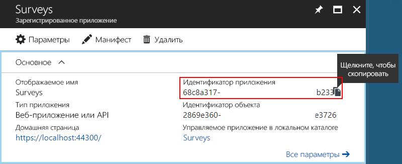
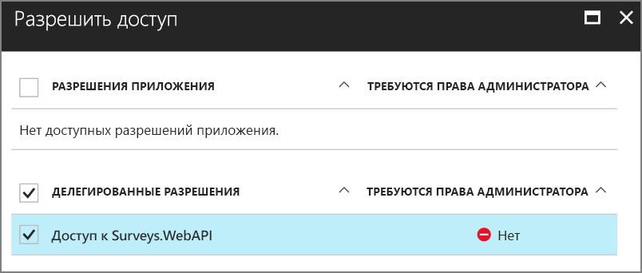
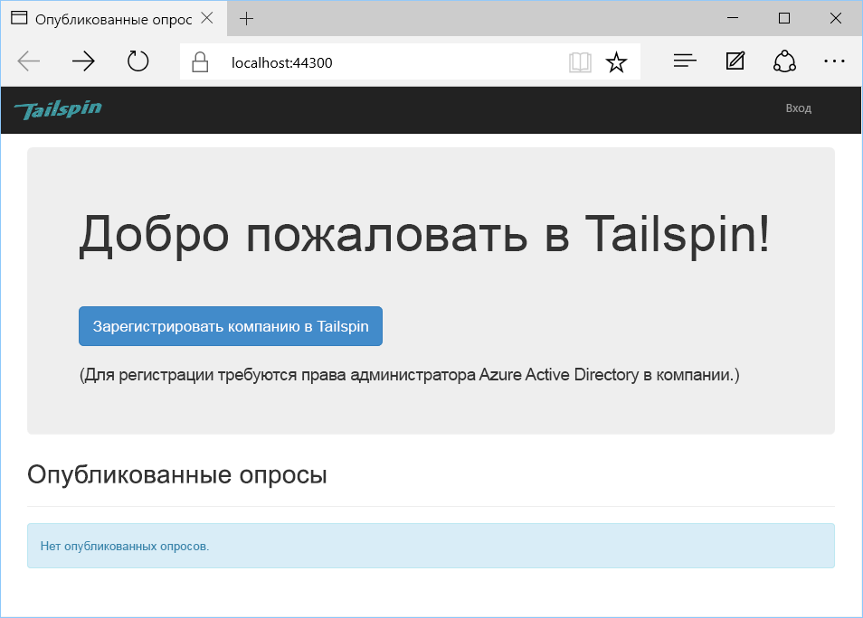
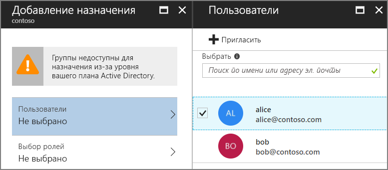

# <a name="run-the-surveys-application"></a><span data-ttu-id="11f63-103">Запуск приложения Surveys</span><span class="sxs-lookup"><span data-stu-id="11f63-103">Run the Surveys application</span></span>

<span data-ttu-id="11f63-104">В этой статье объясняется, как запустить приложение [Tailspin Surveys](./tailspin.md) локально с помощью Visual Studio.</span><span class="sxs-lookup"><span data-stu-id="11f63-104">This article describes how to run the [Tailspin Surveys](./tailspin.md) application locally, from Visual Studio.</span></span> <span data-ttu-id="11f63-105">В этом пошаговом руководстве вы не будете развертывать приложение в Azure.</span><span class="sxs-lookup"><span data-stu-id="11f63-105">In these steps, you won't deploy the application to Azure.</span></span> <span data-ttu-id="11f63-106">Но вам потребуется создать некоторые ресурсы Azure &mdash; каталог Azure Active Directory (Azure AD) и кэш Redis.</span><span class="sxs-lookup"><span data-stu-id="11f63-106">However, you will need to create some Azure resources &mdash; an Azure Active Directory (Azure AD) directory and a Redis cache.</span></span>

<span data-ttu-id="11f63-107">Вот краткий перечень шагов:</span><span class="sxs-lookup"><span data-stu-id="11f63-107">Here is a summary of the steps:</span></span>

1. <span data-ttu-id="11f63-108">Создание каталога (клиента) Azure AD для вымышленной компании Tailspin.</span><span class="sxs-lookup"><span data-stu-id="11f63-108">Create an Azure AD directory (tenant) for the fictitious Tailspin company.</span></span>
2. <span data-ttu-id="11f63-109">Регистрация приложения Surveys и серверного веб-API с помощью Azure AD.</span><span class="sxs-lookup"><span data-stu-id="11f63-109">Register the Surveys application and the backend web API with Azure AD.</span></span>
3. <span data-ttu-id="11f63-110">Создание экземпляра кэша Redis для Azure.</span><span class="sxs-lookup"><span data-stu-id="11f63-110">Create an Azure Redis Cache instance.</span></span>
4. <span data-ttu-id="11f63-111">Настройка параметров приложения и создание локальной базы данных.</span><span class="sxs-lookup"><span data-stu-id="11f63-111">Configure application settings and create a local database.</span></span>
5. <span data-ttu-id="11f63-112">Запуск приложения и регистрация нового клиента.</span><span class="sxs-lookup"><span data-stu-id="11f63-112">Run the application and sign up a new tenant.</span></span>
6. <span data-ttu-id="11f63-113">Добавление ролей приложения для пользователей.</span><span class="sxs-lookup"><span data-stu-id="11f63-113">Add application roles to users.</span></span>

## <a name="prerequisites"></a><span data-ttu-id="11f63-114">Предварительные требования</span><span class="sxs-lookup"><span data-stu-id="11f63-114">Prerequisites</span></span>
-   <span data-ttu-id="11f63-115">[Visual Studio 2017.][VS2017]</span><span class="sxs-lookup"><span data-stu-id="11f63-115">[Visual Studio 2017][VS2017]</span></span>
-   <span data-ttu-id="11f63-116">Учетная запись [Microsoft Azure](https://azure.microsoft.com).</span><span class="sxs-lookup"><span data-stu-id="11f63-116">[Microsoft Azure](https://azure.microsoft.com) account</span></span>

## <a name="create-the-tailspin-tenant"></a><span data-ttu-id="11f63-117">Создание клиента Tailspin</span><span class="sxs-lookup"><span data-stu-id="11f63-117">Create the Tailspin tenant</span></span>

<span data-ttu-id="11f63-118">Tailspin — это вымышленная компания, которая размещает приложение Surveys.</span><span class="sxs-lookup"><span data-stu-id="11f63-118">Tailspin is the fictitious company that hosts the Surveys application.</span></span> <span data-ttu-id="11f63-119">В Tailspin используется Azure AD, чтобы другие клиенты могли регистрироваться в приложении.</span><span class="sxs-lookup"><span data-stu-id="11f63-119">Tailspin uses Azure AD to enable other tenants to register with the app.</span></span> <span data-ttu-id="11f63-120">Эти клиенты затем могут использовать свои учетные данные Azure AD для входа в приложение.</span><span class="sxs-lookup"><span data-stu-id="11f63-120">Those customers can then use their Azure AD credentials to sign into the app.</span></span>

<span data-ttu-id="11f63-121">На этом этапе вы создадите каталог Azure AD для Tailspin.</span><span class="sxs-lookup"><span data-stu-id="11f63-121">In this step, you'll create an Azure AD directory for Tailspin.</span></span>

1. <span data-ttu-id="11f63-122">Войдите на [портал Azure][portal].</span><span class="sxs-lookup"><span data-stu-id="11f63-122">Sign into the [Azure portal][portal].</span></span>

2. <span data-ttu-id="11f63-123">Последовательно выберите **Создать** > **Безопасность и идентификация** > **Azure Active Directory**.</span><span class="sxs-lookup"><span data-stu-id="11f63-123">Click **New** > **Security + Identity** > **Azure Active Directory**.</span></span>

3. <span data-ttu-id="11f63-124">В качестве имени организации введите `Tailspin` и укажите доменное имя.</span><span class="sxs-lookup"><span data-stu-id="11f63-124">Enter `Tailspin` for the organization name, and enter a domain name.</span></span> <span data-ttu-id="11f63-125">Доменное имя отобразится в формате `xxxx.onmicrosoft.com`. Оно должно быть глобально уникальным.</span><span class="sxs-lookup"><span data-stu-id="11f63-125">The domain name will have the form `xxxx.onmicrosoft.com` and must be globally unique.</span></span> 

    

4. <span data-ttu-id="11f63-126">Щелкните **Создать**.</span><span class="sxs-lookup"><span data-stu-id="11f63-126">Click **Create**.</span></span> <span data-ttu-id="11f63-127">Создание каталога может занять несколько минут.</span><span class="sxs-lookup"><span data-stu-id="11f63-127">It may take a few minutes to create the new directory.</span></span>

<span data-ttu-id="11f63-128">Чтобы выполнить комплексный сценарий, вам потребуется второй каталог Azure AD для представления клиента, который регистрируется в приложении.</span><span class="sxs-lookup"><span data-stu-id="11f63-128">To complete the end-to-end scenario, you'll need a second Azure AD directory to represent a customer that signs up for the application.</span></span> <span data-ttu-id="11f63-129">Для этого вы можете использовать каталог Azure AD по умолчанию (не Tailspin) или создать новый.</span><span class="sxs-lookup"><span data-stu-id="11f63-129">You can use your default Azure AD directory (not Tailspin), or create a new directory for this purpose.</span></span> <span data-ttu-id="11f63-130">В примерах мы используем Contoso в качестве вымышленного клиента.</span><span class="sxs-lookup"><span data-stu-id="11f63-130">In the examples, we use Contoso as the fictitious customer.</span></span>

## <a name="register-the-surveys-web-api"></a><span data-ttu-id="11f63-131">Регистрация веб-API приложения Surveys</span><span class="sxs-lookup"><span data-stu-id="11f63-131">Register the Surveys web API</span></span> 

1. <span data-ttu-id="11f63-132">На [портале Azure][portal] перейдите в новый каталог Tailspin. Для этого выберите свою учетную запись в правом верхнем углу портала.</span><span class="sxs-lookup"><span data-stu-id="11f63-132">In the [Azure portal][portal], switch to the new Tailspin directory by selecting your account in the top right corner of the portal.</span></span>

2. <span data-ttu-id="11f63-133">В области навигации слева щелкните **Azure Active Directory**.</span><span class="sxs-lookup"><span data-stu-id="11f63-133">In the left-hand navigation pane, choose **Azure Active Directory**.</span></span> 

3. <span data-ttu-id="11f63-134">Последовательно выберите **Регистрация приложений** > **Регистрация нового приложения**.</span><span class="sxs-lookup"><span data-stu-id="11f63-134">Click **App registrations** > **New application registration**.</span></span>

4.  <span data-ttu-id="11f63-135">В колонке **Создание** задайте следующие параметры:</span><span class="sxs-lookup"><span data-stu-id="11f63-135">In the **Create** blade, enter the following information:</span></span>

  - <span data-ttu-id="11f63-136">**Имя**: `Surveys.WebAPI`;</span><span class="sxs-lookup"><span data-stu-id="11f63-136">**Name**: `Surveys.WebAPI`</span></span>

  - <span data-ttu-id="11f63-137">**Тип приложения**: `Web app / API`;</span><span class="sxs-lookup"><span data-stu-id="11f63-137">**Application type**: `Web app / API`</span></span>

  - <span data-ttu-id="11f63-138">**URL-адрес для входа**: `https://localhost:44301/`.</span><span class="sxs-lookup"><span data-stu-id="11f63-138">**Sign-on URL**: `https://localhost:44301/`</span></span>
   
   

5. <span data-ttu-id="11f63-139">Щелкните **Создать**.</span><span class="sxs-lookup"><span data-stu-id="11f63-139">Click **Create**.</span></span>

6. <span data-ttu-id="11f63-140">В колонке **Регистрация приложений** выберите новое приложение **Surveys.WebAPI**.</span><span class="sxs-lookup"><span data-stu-id="11f63-140">In the **App registrations** blade, select the new **Surveys.WebAPI** application.</span></span>
 
7. <span data-ttu-id="11f63-141">Щелкните **Свойства**.</span><span class="sxs-lookup"><span data-stu-id="11f63-141">Click **Properties**.</span></span>

8. <span data-ttu-id="11f63-142">В поле ввода **URI кода приложения** укажите `https://<domain>/surveys.webapi`, где `<domain>` — доменное имя каталога.</span><span class="sxs-lookup"><span data-stu-id="11f63-142">In the **App ID URI** edit box, enter `https://<domain>/surveys.webapi`, where `<domain>` is the domain name of the directory.</span></span> <span data-ttu-id="11f63-143">Например: `https://tailspin.onmicrosoft.com/surveys.webapi`</span><span class="sxs-lookup"><span data-stu-id="11f63-143">For example: `https://tailspin.onmicrosoft.com/surveys.webapi`</span></span>

    

9. <span data-ttu-id="11f63-145">Задайте для параметра **Мультитенантный** значение **Да**.</span><span class="sxs-lookup"><span data-stu-id="11f63-145">Set **Multi-tenanted** to **YES**.</span></span>

10. <span data-ttu-id="11f63-146">Щелкните **Сохранить**.</span><span class="sxs-lookup"><span data-stu-id="11f63-146">Click **Save**.</span></span>

## <a name="register-the-surveys-web-app"></a><span data-ttu-id="11f63-147">Регистрация веб-приложения Surveys</span><span class="sxs-lookup"><span data-stu-id="11f63-147">Register the Surveys web app</span></span> 

1.  <span data-ttu-id="11f63-148">Вернитесь к колонке **Регистрация приложений** и щелкните **Регистрация нового приложения**.</span><span class="sxs-lookup"><span data-stu-id="11f63-148">Navigate back to the **App registrations** blade, and click **New application registration**.</span></span>

2.  <span data-ttu-id="11f63-149">В колонке **Создание** задайте следующие параметры:</span><span class="sxs-lookup"><span data-stu-id="11f63-149">In the **Create** blade, enter the following information:</span></span>

  - <span data-ttu-id="11f63-150">**Имя**: `Surveys`;</span><span class="sxs-lookup"><span data-stu-id="11f63-150">**Name**: `Surveys`</span></span>
  - <span data-ttu-id="11f63-151">**Тип приложения**: `Web app / API`;</span><span class="sxs-lookup"><span data-stu-id="11f63-151">**Application type**: `Web app / API`</span></span>
  - <span data-ttu-id="11f63-152">**URL-адрес для входа**: `https://localhost:44300/`.</span><span class="sxs-lookup"><span data-stu-id="11f63-152">**Sign-on URL**: `https://localhost:44300/`</span></span>
   
    <span data-ttu-id="11f63-153">Обратите внимание, что в URL-адресе для входа указан другой номер порта, отличный от номера порта для приложения `Surveys.WebAPI` на предыдущем шаге.</span><span class="sxs-lookup"><span data-stu-id="11f63-153">Notice that the sign-on URL has a different port number from the `Surveys.WebAPI` app in the previous step.</span></span>

3. <span data-ttu-id="11f63-154">Щелкните **Создать**.</span><span class="sxs-lookup"><span data-stu-id="11f63-154">Click **Create**.</span></span>
 
4. <span data-ttu-id="11f63-155">В колонке **Регистрация приложений** выберите новое приложение **Surveys**.</span><span class="sxs-lookup"><span data-stu-id="11f63-155">In the **App registrations** blade, select the new **Surveys** application.</span></span>
 
5. <span data-ttu-id="11f63-156">Скопируйте идентификатор приложения.</span><span class="sxs-lookup"><span data-stu-id="11f63-156">Copy the application ID.</span></span> <span data-ttu-id="11f63-157">Этот идентификатор потребуется позднее.</span><span class="sxs-lookup"><span data-stu-id="11f63-157">You will need this later.</span></span>

    

6. <span data-ttu-id="11f63-158">Щелкните **Свойства**.</span><span class="sxs-lookup"><span data-stu-id="11f63-158">Click **Properties**.</span></span>

7. <span data-ttu-id="11f63-159">В поле ввода **URI кода приложения** укажите `https://<domain>/surveys`, где `<domain>` — доменное имя каталога.</span><span class="sxs-lookup"><span data-stu-id="11f63-159">In the **App ID URI** edit box, enter `https://<domain>/surveys`, where `<domain>` is the domain name of the directory.</span></span> 

    

8. <span data-ttu-id="11f63-161">Задайте для параметра **Мультитенантный** значение **Да**.</span><span class="sxs-lookup"><span data-stu-id="11f63-161">Set **Multi-tenanted** to **YES**.</span></span>

9. <span data-ttu-id="11f63-162">Щелкните **Сохранить**.</span><span class="sxs-lookup"><span data-stu-id="11f63-162">Click **Save**.</span></span>

10. <span data-ttu-id="11f63-163">В колонке **Параметры** щелкните **URL-адреса ответа**.</span><span class="sxs-lookup"><span data-stu-id="11f63-163">In the **Settings** blade, click **Reply URLs**.</span></span>
 
11. <span data-ttu-id="11f63-164">Добавьте такой URL-адрес ответа: `https://localhost:44300/signin-oidc`.</span><span class="sxs-lookup"><span data-stu-id="11f63-164">Add the following reply URL: `https://localhost:44300/signin-oidc`.</span></span>

12. <span data-ttu-id="11f63-165">Щелкните **Сохранить**.</span><span class="sxs-lookup"><span data-stu-id="11f63-165">Click **Save**.</span></span>

13. <span data-ttu-id="11f63-166">В разделе **Доступ через API** щелкните **Ключи**.</span><span class="sxs-lookup"><span data-stu-id="11f63-166">Under **API ACCESS**, click **Keys**.</span></span>

14. <span data-ttu-id="11f63-167">Введите описание, например `client secret`.</span><span class="sxs-lookup"><span data-stu-id="11f63-167">Enter a description, such as `client secret`.</span></span>

15. <span data-ttu-id="11f63-168">В раскрывающемся списке **Выбрать длительность** выберите **1 год**.</span><span class="sxs-lookup"><span data-stu-id="11f63-168">In the **Select Duration** dropdown, select **1 year**.</span></span> 

16. <span data-ttu-id="11f63-169">Щелкните **Сохранить**.</span><span class="sxs-lookup"><span data-stu-id="11f63-169">Click **Save**.</span></span> <span data-ttu-id="11f63-170">При сохранении будет создан ключ.</span><span class="sxs-lookup"><span data-stu-id="11f63-170">The key will be generated when you save.</span></span>

17. <span data-ttu-id="11f63-171">Прежде чем покинуть эту колонку, скопируйте значение ключа.</span><span class="sxs-lookup"><span data-stu-id="11f63-171">Before you navigate away from this blade, copy the value of the key.</span></span>

    > [!NOTE] 
    > <span data-ttu-id="11f63-172">Когда вы выйдете из этой колонки, ключ перестанет отображаться.</span><span class="sxs-lookup"><span data-stu-id="11f63-172">The key won't be visible again after you navigate away from the blade.</span></span> 

18. <span data-ttu-id="11f63-173">В разделе **Доступ через API** щелкните **Требуемые разрешения**.</span><span class="sxs-lookup"><span data-stu-id="11f63-173">Under **API ACCESS**, click **Required permissions**.</span></span>

19. <span data-ttu-id="11f63-174">Последовательно выберите **Добавить** > **Выбор API**.</span><span class="sxs-lookup"><span data-stu-id="11f63-174">Click **Add** > **Select an API**.</span></span>

20. <span data-ttu-id="11f63-175">В поле поиска введите `Surveys.WebAPI`.</span><span class="sxs-lookup"><span data-stu-id="11f63-175">In the search box, search for `Surveys.WebAPI`.</span></span>

    

21. <span data-ttu-id="11f63-177">Выберите `Surveys.WebAPI` и щелкните **Выбрать**.</span><span class="sxs-lookup"><span data-stu-id="11f63-177">Select `Surveys.WebAPI` and click **Select**.</span></span>

22. <span data-ttu-id="11f63-178">В разделе **Делегированные разрешения** установите флажок **Доступ к Surveys.WebAPI**.</span><span class="sxs-lookup"><span data-stu-id="11f63-178">Under **Delegated Permissions**, check **Access Surveys.WebAPI**.</span></span>

    

23. <span data-ttu-id="11f63-180">Последовательно щелкните **Выбрать** > **Готово**.</span><span class="sxs-lookup"><span data-stu-id="11f63-180">Click **Select** > **Done**.</span></span>


## <a name="update-the-application-manifests"></a><span data-ttu-id="11f63-181">Обновление манифестов приложения</span><span class="sxs-lookup"><span data-stu-id="11f63-181">Update the application manifests</span></span>

1. <span data-ttu-id="11f63-182">Вернитесь к колонке **Параметры** для приложения `Surveys.WebAPI`.</span><span class="sxs-lookup"><span data-stu-id="11f63-182">Navigate back to the **Settings** blade for the `Surveys.WebAPI` app.</span></span>

2. <span data-ttu-id="11f63-183">Последовательно выберите **Манифест** > **Изменить**.</span><span class="sxs-lookup"><span data-stu-id="11f63-183">Click **Manifest** > **Edit**.</span></span>

    
 
3.  <span data-ttu-id="11f63-184">Добавьте в элемент `appRoles` приведенный ниже код JSON.</span><span class="sxs-lookup"><span data-stu-id="11f63-184">Add the following JSON to the `appRoles` element.</span></span> <span data-ttu-id="11f63-185">Создайте идентификаторы GUID для свойств `id`.</span><span class="sxs-lookup"><span data-stu-id="11f63-185">Generate new GUIDs for the `id` properties.</span></span>

    ```json
    {
      "allowedMemberTypes": ["User"],
      "description": "Creators can create surveys",
      "displayName": "SurveyCreator",
      "id": "<Generate a new GUID. Example: 1b4f816e-5eaf-48b9-8613-7923830595ad>",
      "isEnabled": true,
      "value": "SurveyCreator"
    },
    {
      "allowedMemberTypes": ["User"],
      "description": "Administrators can manage the surveys in their tenant",
      "displayName": "SurveyAdmin",
      "id": "<Generate a new GUID>",  
      "isEnabled": true,
      "value": "SurveyAdmin"
    }
    ```

5.  <span data-ttu-id="11f63-186">В свойство `knownClientApplications` добавьте идентификатор веб-приложения Surveys, который вы получили при регистрации этого приложения ранее.</span><span class="sxs-lookup"><span data-stu-id="11f63-186">In the `knownClientApplications` property, add the application ID for the Surveys web application, which you got when you registered the Surveys application earlier.</span></span> <span data-ttu-id="11f63-187">Например:</span><span class="sxs-lookup"><span data-stu-id="11f63-187">For example:</span></span>

  ```json
  "knownClientApplications": ["be2cea23-aa0e-4e98-8b21-2963d494912e"],
  ```

  <span data-ttu-id="11f63-188">Этот параметр позволяет добавить приложение Surveys в список клиентов с правами на вызов веб-API.</span><span class="sxs-lookup"><span data-stu-id="11f63-188">This setting adds the Surveys app to the list of clients authorized to call the web API.</span></span>

6.  <span data-ttu-id="11f63-189">Щелкните **Сохранить**.</span><span class="sxs-lookup"><span data-stu-id="11f63-189">Click **Save**.</span></span>

<span data-ttu-id="11f63-190">Теперь повторите те же действия для приложения Surveys, но не добавляйте запись для `knownClientApplications`.</span><span class="sxs-lookup"><span data-stu-id="11f63-190">Now repeat the same steps for the Surveys app, except do not add an entry for `knownClientApplications`.</span></span> <span data-ttu-id="11f63-191">Используйте те же определения ролей, но создайте новые идентификаторы GUID для идентификаторов.</span><span class="sxs-lookup"><span data-stu-id="11f63-191">Use the same role definitions, but generate new GUIDs for the IDs.</span></span>

## <a name="create-a-new-redis-cache-instance"></a><span data-ttu-id="11f63-192">Создание экземпляра кэша Redis для Azure</span><span class="sxs-lookup"><span data-stu-id="11f63-192">Create a new Redis Cache instance</span></span>

<span data-ttu-id="11f63-193">Приложение Surveys использует Redis для кэширования маркеров доступа OAuth 2.</span><span class="sxs-lookup"><span data-stu-id="11f63-193">The Surveys application uses Redis to cache OAuth 2 access tokens.</span></span> <span data-ttu-id="11f63-194">Чтобы создать кэш, сделайте следующее:</span><span class="sxs-lookup"><span data-stu-id="11f63-194">To create the cache:</span></span>

1.  <span data-ttu-id="11f63-195">Перейдите на [портал Azure](https://portal.azure.com) и последовательно выберите **Создать** > **Базы данных** > **Кэш Redis**.</span><span class="sxs-lookup"><span data-stu-id="11f63-195">Go to [Azure Portal](https://portal.azure.com) and click **New** > **Databases** > **Redis Cache**.</span></span>

2.  <span data-ttu-id="11f63-196">Укажите необходимые сведения, в том числе DNS-имя, группу ресурсов, расположение и ценовую категорию.</span><span class="sxs-lookup"><span data-stu-id="11f63-196">Fill in the required information, including DNS name, resource group, location, and pricing tier.</span></span> <span data-ttu-id="11f63-197">Вы можете создать новую группу ресурсов или использовать существующую.</span><span class="sxs-lookup"><span data-stu-id="11f63-197">You can create a new resource group or use an existing resource group.</span></span>

3. <span data-ttu-id="11f63-198">Щелкните **Создать**.</span><span class="sxs-lookup"><span data-stu-id="11f63-198">Click **Create**.</span></span>

4. <span data-ttu-id="11f63-199">Когда кэш Redis будет создан, перейдите к ресурсу на портале.</span><span class="sxs-lookup"><span data-stu-id="11f63-199">After the Resis cache is created, navigate to the resource in the portal.</span></span>

5. <span data-ttu-id="11f63-200">Щелкните **Ключи доступа** и скопируйте первичный ключ.</span><span class="sxs-lookup"><span data-stu-id="11f63-200">Click **Access keys** and copy the primary key.</span></span>

<span data-ttu-id="11f63-201">Дополнительные сведения о создании кэша Redis см. в статье [Как использовать кэш Redis для Azure](/azure/redis-cache/cache-dotnet-how-to-use-azure-redis-cache).</span><span class="sxs-lookup"><span data-stu-id="11f63-201">For more information about creating a Redis cache, see [How to Use Azure Redis Cache](/azure/redis-cache/cache-dotnet-how-to-use-azure-redis-cache).</span></span>

## <a name="set-application-secrets"></a><span data-ttu-id="11f63-202">Установка секретов приложения</span><span class="sxs-lookup"><span data-stu-id="11f63-202">Set application secrets</span></span>

1.  <span data-ttu-id="11f63-203">Откройте решение Tailspin.Surveys в Visual Studio.</span><span class="sxs-lookup"><span data-stu-id="11f63-203">Open the Tailspin.Surveys solution in Visual Studio.</span></span>

2.  <span data-ttu-id="11f63-204">В обозревателе решений щелкните правой кнопкой мыши проект Tailspin.Surveys.Web и выберите пункт **Управление секретами пользователей**.</span><span class="sxs-lookup"><span data-stu-id="11f63-204">In Solution Explorer, right-click the Tailspin.Surveys.Web project and select **Manage User Secrets**.</span></span>

3.  <span data-ttu-id="11f63-205">Вставьте следующий код в файл secrets.json:</span><span class="sxs-lookup"><span data-stu-id="11f63-205">In the secrets.json file, paste in the following:</span></span>
    
    ```json
    {
      "AzureAd": {
        "ClientId": "<Surveys application ID>",
        "ClientSecret": "<Surveys app client secret>",
        "PostLogoutRedirectUri": "https://localhost:44300/",
        "WebApiResourceId": "<Surveys.WebAPI app ID URI>"
      },
      "Redis": {
        "Configuration": "<Redis DNS name>.redis.cache.windows.net,password=<Redis primary key>,ssl=true"
      }
    }
    ```
   
    <span data-ttu-id="11f63-206">Замените элементы, отображаемые в угловых скобках, следующими значениями:</span><span class="sxs-lookup"><span data-stu-id="11f63-206">Replace the items shown in angle brackets, as follows:</span></span>

    - <span data-ttu-id="11f63-207">`AzureAd:ClientId`: идентификатор приложения Surveys.</span><span class="sxs-lookup"><span data-stu-id="11f63-207">`AzureAd:ClientId`: The application ID of the Surveys app.</span></span>
    - <span data-ttu-id="11f63-208">`AzureAd:ClientSecret`: ключ, созданный при регистрации приложения Surveys в Azure AD.</span><span class="sxs-lookup"><span data-stu-id="11f63-208">`AzureAd:ClientSecret`: The key that you generated when you registered the Surveys application in Azure AD.</span></span>
    - <span data-ttu-id="11f63-209">`AzureAd:WebApiResourceId`: код URI идентификатора приложения, указанный при создании приложения Surveys.WebAPI в Azure AD.</span><span class="sxs-lookup"><span data-stu-id="11f63-209">`AzureAd:WebApiResourceId`: The App ID URI that you specified when you created the Surveys.WebAPI application in Azure AD.</span></span> <span data-ttu-id="11f63-210">Он должен быть в таком формате: `https://<directory>.onmicrosoft.com/surveys.webapi`.</span><span class="sxs-lookup"><span data-stu-id="11f63-210">It should have the form `https://<directory>.onmicrosoft.com/surveys.webapi`</span></span>
    - <span data-ttu-id="11f63-211">`Redis:Configuration`: создайте эту строку из DNS-имени кэша Redis и первичного ключа доступа.</span><span class="sxs-lookup"><span data-stu-id="11f63-211">`Redis:Configuration`: Build this string from the DNS name of the Redis cache and the primary access key.</span></span> <span data-ttu-id="11f63-212">Например: tailspin.redis.cache.windows.net,password=2h5tBxxx,ssl=true.</span><span class="sxs-lookup"><span data-stu-id="11f63-212">For example, "tailspin.redis.cache.windows.net,password=2h5tBxxx,ssl=true".</span></span>

4.  <span data-ttu-id="11f63-213">Сохраните обновленный файл secrets.json.</span><span class="sxs-lookup"><span data-stu-id="11f63-213">Save the updated secrets.json file.</span></span>

5.  <span data-ttu-id="11f63-214">Повторите эти действия для проекта Tailspin.Surveys.WebAPI, но добавьте в файл secrets.json приведенный ниже код.</span><span class="sxs-lookup"><span data-stu-id="11f63-214">Repeat these steps for the Tailspin.Surveys.WebAPI project, but paste the following into secrets.json.</span></span> <span data-ttu-id="11f63-215">Замените элементы в угловых скобках, как вы сделали это раньше.</span><span class="sxs-lookup"><span data-stu-id="11f63-215">Replace the items in angle brackets, as before.</span></span>

    ```json
    {
      "AzureAd": {
        "WebApiResourceId": "<Surveys.WebAPI app ID URI>"
      },
      "Redis": {
        "Configuration": "<Redis DNS name>.redis.cache.windows.net,password=<Redis primary key>,ssl=true"
      }
    }
    ```

## <a name="initialize-the-database"></a><span data-ttu-id="11f63-216">Инициализация базы данных</span><span class="sxs-lookup"><span data-stu-id="11f63-216">Initialize the database</span></span>

<span data-ttu-id="11f63-217">На этом шаге вы будете применять Entity Framework 7 для создания локальной базы данных SQL, использующей LocalDB.</span><span class="sxs-lookup"><span data-stu-id="11f63-217">In this step, you will use Entity Framework 7 to create a local SQL database, using LocalDB.</span></span>

1.  <span data-ttu-id="11f63-218">Откройте командное окно.</span><span class="sxs-lookup"><span data-stu-id="11f63-218">Open a command window</span></span>

2.  <span data-ttu-id="11f63-219">Перейдите к проекту Tailspin.Surveys.Data.</span><span class="sxs-lookup"><span data-stu-id="11f63-219">Navigate to the Tailspin.Surveys.Data project.</span></span>

3.  <span data-ttu-id="11f63-220">Выполните следующую команду:</span><span class="sxs-lookup"><span data-stu-id="11f63-220">Run the following command:</span></span>

    ```
    dotnet ef database update --startup-project ..\Tailspin.Surveys.Web
    ```
    
## <a name="run-the-application"></a><span data-ttu-id="11f63-221">Выполнение приложения</span><span class="sxs-lookup"><span data-stu-id="11f63-221">Run the application</span></span>

<span data-ttu-id="11f63-222">Чтобы запустить приложение, запустите проекты Tailspin.Surveys.Web и Tailspin.Surveys.WebAPI.</span><span class="sxs-lookup"><span data-stu-id="11f63-222">To run the application, start both the Tailspin.Surveys.Web and Tailspin.Surveys.WebAPI projects.</span></span>

<span data-ttu-id="11f63-223">В Visual Studio можно настроить автоматический запуск обоих проектов при нажатии клавиши F5. Для этого сделайте следующее:</span><span class="sxs-lookup"><span data-stu-id="11f63-223">You can set Visual Studio to run both projects automatically on F5, as follows:</span></span>

1.  <span data-ttu-id="11f63-224">В обозревателе решений щелкните решение правой кнопкой мыши и выберите **Назначить запускаемые проекты**.</span><span class="sxs-lookup"><span data-stu-id="11f63-224">In Solution Explorer, right-click the solution and click **Set Startup Projects**.</span></span>
2.  <span data-ttu-id="11f63-225">Выберите **Несколько запускаемых проектов**.</span><span class="sxs-lookup"><span data-stu-id="11f63-225">Select **Multiple startup projects**.</span></span>
3.  <span data-ttu-id="11f63-226">Задайте значение **Действие** = **Запуск** для проектов Tailspin.Surveys.Web и Tailspin.Surveys.WebAPI.</span><span class="sxs-lookup"><span data-stu-id="11f63-226">Set **Action** = **Start** for the Tailspin.Surveys.Web and Tailspin.Surveys.WebAPI projects.</span></span>

## <a name="sign-up-a-new-tenant"></a><span data-ttu-id="11f63-227">Регистрация нового клиента</span><span class="sxs-lookup"><span data-stu-id="11f63-227">Sign up a new tenant</span></span>

<span data-ttu-id="11f63-228">При запуске приложения вход не будет выполнен, поэтому вы увидите страницу приветствия.</span><span class="sxs-lookup"><span data-stu-id="11f63-228">When the application starts, you are not signed in, so you see the welcome page:</span></span>



<span data-ttu-id="11f63-230">Чтобы зарегистрировать организацию, сделайте следующее:</span><span class="sxs-lookup"><span data-stu-id="11f63-230">To sign up an organization:</span></span>

1. <span data-ttu-id="11f63-231">Нажмите кнопку **Enroll your company in Tailspin** (Зарегистрировать компанию в Tailspin).</span><span class="sxs-lookup"><span data-stu-id="11f63-231">Click **Enroll your company in Tailspin**.</span></span>
2. <span data-ttu-id="11f63-232">Войдите в каталог Azure AD, который представляет организацию, использующую приложение Surveys.</span><span class="sxs-lookup"><span data-stu-id="11f63-232">Sign in to the Azure AD directory that represents the organization using the Surveys app.</span></span> <span data-ttu-id="11f63-233">Необходимо войти от имени администратора.</span><span class="sxs-lookup"><span data-stu-id="11f63-233">You must sign in as an admin user.</span></span>
3. <span data-ttu-id="11f63-234">Примите запрос на продолжение.</span><span class="sxs-lookup"><span data-stu-id="11f63-234">Accept the consent prompt.</span></span>

<span data-ttu-id="11f63-235">В приложении будет выполнена регистрация клиента, и вы выйдете из приложения. Выход выполняется, потому что вам нужно настроить роли приложения в Azure AD, прежде чем использовать приложение.</span><span class="sxs-lookup"><span data-stu-id="11f63-235">The application registers the tenant, and then signs you out. The app signs you out because you need to set up the application roles in Azure AD, before using the application.</span></span>


## <a name="assign-application-roles"></a><span data-ttu-id="11f63-237">Назначение ролей приложения</span><span class="sxs-lookup"><span data-stu-id="11f63-237">Assign application roles</span></span>

<span data-ttu-id="11f63-238">При регистрации клиента администратор AD для клиента должен назначить роли приложения пользователям.</span><span class="sxs-lookup"><span data-stu-id="11f63-238">When a tenant signs up, an AD admin for the tenant must assign application roles to users.</span></span>


1. <span data-ttu-id="11f63-239">На [портале Azure][portal] перейдите к каталогу Azure AD, который использовался для регистрации приложения Surveys.</span><span class="sxs-lookup"><span data-stu-id="11f63-239">In the [Azure portal][portal], switch to the Azure AD directory that you used to sign up for the Surveys app.</span></span> 

2. <span data-ttu-id="11f63-240">В области навигации слева щелкните **Azure Active Directory**.</span><span class="sxs-lookup"><span data-stu-id="11f63-240">In the left-hand navigation pane, choose **Azure Active Directory**.</span></span> 

3. <span data-ttu-id="11f63-241">Последовательно выберите **Корпоративные приложения** > **Все приложения**.</span><span class="sxs-lookup"><span data-stu-id="11f63-241">Click **Enterprise applications** > **All applications**.</span></span> <span data-ttu-id="11f63-242">На портале отобразятся имена приложений `Survey` и `Survey.WebAPI`.</span><span class="sxs-lookup"><span data-stu-id="11f63-242">The portal will list `Survey` and `Survey.WebAPI`.</span></span> <span data-ttu-id="11f63-243">В противном случае убедитесь, что вы завершили регистрацию.</span><span class="sxs-lookup"><span data-stu-id="11f63-243">If not, make sure that you completed the sign up process.</span></span>

4.  <span data-ttu-id="11f63-244">Выберите приложение Surveys.</span><span class="sxs-lookup"><span data-stu-id="11f63-244">Click on the Surveys application.</span></span>

5.  <span data-ttu-id="11f63-245">Щелкните **Пользователи и группы**.</span><span class="sxs-lookup"><span data-stu-id="11f63-245">Click **Users and Groups**.</span></span>

4.  <span data-ttu-id="11f63-246">Нажмите кнопку **Добавить пользователя**.</span><span class="sxs-lookup"><span data-stu-id="11f63-246">Click **Add user**.</span></span>

5.  <span data-ttu-id="11f63-247">Если вы используете Azure AD Premium, выберите **Пользователи и группы**.</span><span class="sxs-lookup"><span data-stu-id="11f63-247">If you have Azure AD Premium, click **Users and groups**.</span></span> <span data-ttu-id="11f63-248">В противном случае выберите **Пользователи**.</span><span class="sxs-lookup"><span data-stu-id="11f63-248">Otherwise, click **Users**.</span></span> <span data-ttu-id="11f63-249">(Чтобы назначить роль группе, требуется Azure AD Premium.)</span><span class="sxs-lookup"><span data-stu-id="11f63-249">(Assigning a role to a group requires Azure AD Premium.)</span></span>

6. <span data-ttu-id="11f63-250">Выберите одного или нескольких пользователей и нажмите кнопку **Выбрать**.</span><span class="sxs-lookup"><span data-stu-id="11f63-250">Select one or more users and click **Select**.</span></span>

    

6.  <span data-ttu-id="11f63-252">Выберите роль и нажмите кнопку **Выбрать**.</span><span class="sxs-lookup"><span data-stu-id="11f63-252">Select the role and click **Select**.</span></span>

    

7.  <span data-ttu-id="11f63-254">Щелкните **Назначить**.</span><span class="sxs-lookup"><span data-stu-id="11f63-254">Click **Assign**.</span></span>

<span data-ttu-id="11f63-255">Повторите эти шаги, чтобы назначить роли для приложения Survey.WebAPI.</span><span class="sxs-lookup"><span data-stu-id="11f63-255">Repeat the same steps to assign roles for the Survey.WebAPI application.</span></span>

> <span data-ttu-id="11f63-256">Внимание! Пользователю всегда следует назначать одинаковые роли в приложениях Survey и Survey.WebAPI.</span><span class="sxs-lookup"><span data-stu-id="11f63-256">Important: A user should always have the same roles in both Survey and Survey.WebAPI.</span></span> <span data-ttu-id="11f63-257">В противном случае разрешения пользователя не будут согласованы, что может привести к ошибке 403 (запрещено) в веб-API.</span><span class="sxs-lookup"><span data-stu-id="11f63-257">Otherwise, the user will have inconsistent permissions, which may lead to 403 (Forbidden) errors from the Web API.</span></span>

<span data-ttu-id="11f63-258">Теперь вернитесь в приложение и войдите в него снова.</span><span class="sxs-lookup"><span data-stu-id="11f63-258">Now go back to the app and sign in again.</span></span> <span data-ttu-id="11f63-259">Щелкните **My Surveys** (Мои опросы).</span><span class="sxs-lookup"><span data-stu-id="11f63-259">Click **My Surveys**.</span></span> <span data-ttu-id="11f63-260">Если вам назначена роль SurveyAdmin или SurveyCreator, вы увидите кнопку **Create Survey** (Создать опрос). Это указывает на то, что у вас есть разрешение на создание опроса.</span><span class="sxs-lookup"><span data-stu-id="11f63-260">If the user is assigned to the SurveyAdmin or SurveyCreator role, you will see a **Create Survey** button, indicating that the user has permissions to create a new survey.</span></span>


<!-- links -->

[portal]: https://portal.azure.com
[VS2017]: https://www.visualstudio.com/vs/
