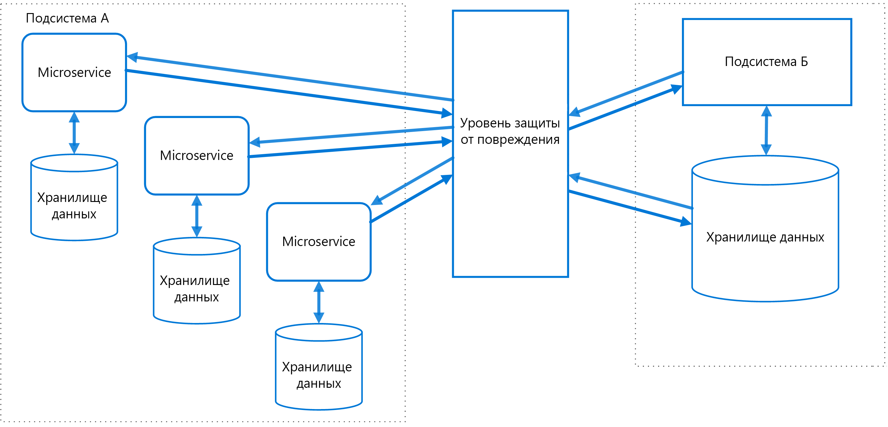

# Шаблон уровня защиты от повреждения

Разместите façade или уровень адаптера между новым приложением и устаревшей системой, от которой он зависит. Этот уровень преобразует запросы между новым приложением и устаревшей системой. Используйте этот шаблон, чтобы убедиться, что разработка приложения не ограничена зависимостями в устаревших системах.

## Контекст и проблема

Большинство приложений используют другие системы для некоторых данных или функций. Например, при миграции приложения прежних версий в новую систему по-прежнему могут потребоваться устаревшие ресурсы. Новые компоненты должны вызвать устаревшую систему. В частности, это относится к постепенным миграциям, где различные компоненты более крупных приложений со временем перемещаются в современные системы.

В устаревших системах часто появляются проблемы с качеством, такие как сложные схемы данных или устаревшие API. Компоненты и технологии, используемые в устаревших системах, могут существенно отличаться от новых систем. Для взаимодействия с устаревшей системой новому приложению может потребоваться поддержка устаревшей инфраструктуры, протоколов, моделей данных, API-интерфейсов или других компонентов, которые в противном случае вы не поместили бы в новое приложение.

Для обеспечения доступа между новыми и устаревшими системами в новой системе может потребоваться принудительно использовать по крайней мере некоторые API-интерфейсы или другую семантику устаревших систем. Если в устаревших компонентах возникают проблемы с качеством, их поддержка может быть нецелесообразна в хорошо спроектированном современном приложении. 

## Решение

Изолируйте устаревшие и новые системы путем размещения уровня защиты от повреждения между ними. Этот уровень преобразует обмен данными между двумя системами, за счет чего устаревшая система не изменяется, а в новом приложении будет сохранена структура и технологический подход.

 

При обмене данными между новым приложением и уровнем защиты от повреждения всегда используется архитектура и модель данных приложения. Вызовы из уровня защиты от повреждения к устаревшей системе осуществляются в соответствии с моделью данных или методами системы. Уровень защиты от повреждения содержит всю логику, необходимую для преобразования между двумя системами. Его можно реализовать как компонент в приложении или как независимую службу.

## Проблемы и рекомендации

- Уровень защиты от повреждения может привести к задержкам в вызовах между системами.
- Уровень защиты от повреждения добавляет дополнительную службу, требующую управления и поддержки.
- Определите способ масштабирования уровня защиты от повреждения.
- Определите количество уровней защиты от повреждения. Вам может потребоваться разделить функциональные возможности на несколько служб, использующих различные технологии и языки. Или же у вас могут быть другие причины для разделения уровня защиты от повреждения.
- Подумайте об управлении уровнем защиты от повреждения в контексте своих приложений и служб, а также о том, как он будет интегрироваться с процессами наблюдения, выпуска и конфигурации.
- Убедитесь в том, что транзакции и целостность данных сохраняются и их можно отслеживать.
- Определите объем задач для уровня защиты от повреждения: обработка всех данных, передаваемых между устаревшими и новыми системами, или только подмножества функций. 
- Настройте срок действия уровня защиты: будет ли он постоянным или прекратит работу после переноса всех устаревших функций.

## Когда следует использовать этот шаблон

Используйте этот шаблон в следующих случаях:

- Планируется миграция в несколько этапов, но необходима поддержка интеграции между новыми и устаревшими системами.
- Семантика новой и устаревшей системы различна, но по-прежнему требуется их взаимодействие.

Этот шаблон неприменим в случае несущественных семантических различий между новыми и устаревшими системами. 

## Связанное руководство

- [Strangler pattern][strangler] (Шаблон Strangler)

[strangler]: ./strangler.md
