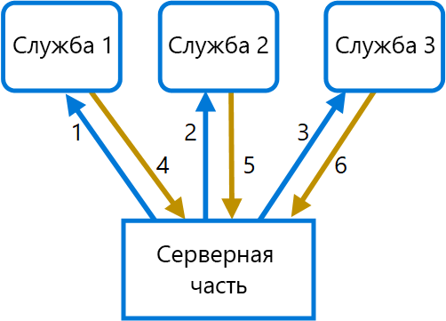
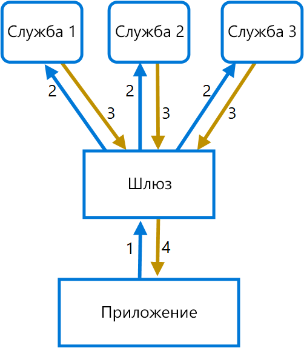

# <a name="gateway-aggregation-pattern"></a>Схема агрегирования на шлюзе

Использование шлюза для объединения нескольких отдельных запросов в один запрос. Эта схема полезна в тех случаях, когда клиенту для выполнения операции приходится отправлять несколько вызовов к разным серверным системам.

## <a name="context-and-problem"></a>Контекст и проблема

Иногда для выполнения одной задачи клиент вынужден обращаться к нескольким разным серверным службам. Приложение, которое использует несколько служб для выполнения задачи, тратит ресурсы на каждый такой запрос. Когда в приложение добавляются новые компоненты или службы, увеличивается и количество запросов, а значит с каждым этапом растет нагрузка на ресурсы и сеть. Большое число запросов от клиента к серверной части неблагоприятно влияет на производительность и масштабирование приложения.  Архитектура микрослужб дополнительно обострила такую проблему, ведь приложения, составленные из большого количества небольших служб, естественным образом используют большое количество вызовов между службами. 

На следующей схеме клиент отправляет запросы к каждой службе (1, 2 и 3). Каждая их них обрабатывает запрос и отправляет ответ обратно в приложение (4, 5 и 6). Если используется сотовая сеть, для которой типичны большие задержки, такое обилие отдельных запросов будет неэффективно и может привести к разрыву связи или неполному выполнению запросов. А поскольку каждый запрос должен выполняться параллельно, приложение поддерживает несколько соединений, в каждом из которых отправляет, ожидает и обрабатывает данные. Это дополнительно повышает вероятность сбоя.

 

## <a name="solution"></a>Решение

Используйте шлюз, чтобы сократить число вызовов между клиентом и службами. Этот шлюз получает запросы от клиентов, распределяет их по серверным системам, затем объединяет результаты и отправляет их запрашивающему клиенту.

Такая схема позволяет сократить число запросов, которые отправляются приложением к серверным службам, и повысить производительность при работе в сетях с высокой задержкой.

На следующей схеме приложение отправляет запрос к шлюзу (1). Этот запрос содержит пакет дополнительных запросов. Шлюз разделяет и обрабатывает эти запросы, отправляя каждый из них соответствующей службе (2). Каждая служба возвращает ответ шлюзу (3). Шлюз собирает все ответы служб и отправляет объединенный ответ в приложение (4). Приложение выполняет только один запрос и получает от шлюза только один ответ.



## <a name="issues-and-considerations"></a>Проблемы и рекомендации

- Шлюз не должен добавлять взаимозависимости между серверными службами.
- Шлюз должен находиться рядом с серверными службами, чтобы максимально снизить задержки в сети.
- Служба шлюза может стать единой точкой отказа. Важно правильно подойти к проектированию шлюза, чтобы он соответствовал требованиям к доступности для вашего приложения.
- Шлюз может стать узким местом системы. Обеспечьте для шлюза достаточную производительность в соответствии с нагрузкой и возможность масштабирования в соответствии с ожидаемым ростом.
- Выполните нагрузочное тестирование шлюза, чтобы исключить возможность каскадных сбоев служб.
- Создайте надежную систему, используя методы [распределительных блоков][bulkhead], [автоматического выключения][circuit-breaker], [повторных попыток][retry] и ограничения времени ожидания.
- Если один или несколько вызовов служб занимают слишком много времени, в некоторых ситуациях допустимо прерывать ожидание и возвращать неполный набор данных. Решите, как приложение должно вести себя в этом случае.
- Используйте асинхронный ввод-вывод, чтобы задержки на серверной части не снижали производительность приложения.
- Реализуйте распределенную трассировку с помощью идентификаторов корреляции, чтобы отслеживать каждый отдельный вызов.
- Контролируйте метрики запросов и размеры ответов.
- Оцените, можно ли возвращать кэшированные данные в качестве резервной меры при возникновении сбоев.
- Оцените, где лучше выполнять агрегирование — на шлюзе или в дополнительной службе, размещенной за шлюзом. Агрегирование запросов будет налагать дополнительные требования к ресурсам, отличные от требований других служб шлюза, и может повлиять на производительность шлюза по маршрутизации и разгрузке.

## <a name="when-to-use-this-pattern"></a>Когда следует использовать этот шаблон

Используйте эту схему в следующих случаях:

- если клиент должен обмениваться данными с несколькими серверными службами для выполнения операции;
- клиент может использовать сети со значительными задержками, например сети сотовой связи;

Эту схему не стоит применять в следующих случаях:

- когда нужно уменьшить количество вызовов между клиентом и одной службой при большом количестве операций. В таком случае лучше реализовать в службе поддержку пакетной обработки.
- клиент или приложение расположены рядом с серверными службами, так что сетевая задержка не является важным фактором.

## <a name="example"></a>Пример

В следующем примере демонстрируется создание простой службы агрегирования на шлюзе NGINX с использованием Lua.

```lua
worker_processes  4;

events {
  worker_connections 1024;
}

http {
  server {
    listen 80;

    location = /batch {
      content_by_lua '
        ngx.req.read_body()

        -- read json body content
        local cjson = require "cjson"
        local batch = cjson.decode(ngx.req.get_body_data())["batch"]

        -- create capture_multi table
        local requests = {}
        for i, item in ipairs(batch) do
          table.insert(requests, {item.relative_url, { method = ngx.HTTP_GET}})
        end

        -- execute batch requests in parallel
        local results = {}
        local resps = { ngx.location.capture_multi(requests) }
        for i, res in ipairs(resps) do
          table.insert(results, {status = res.status, body = cjson.decode(res.body), header = res.header})
        end

        ngx.say(cjson.encode({results = results}))
      ';
    }

    location = /service1 {
      default_type application/json;
      echo '{"attr1":"val1"}';
    }

    location = /service2 {
      default_type application/json;
      echo '{"attr2":"val2"}';
    }
  }
}
```

## <a name="related-guidance"></a>Связанные руководства

- [Схема отдельных серверных частей для каждого интерфейса](./backends-for-frontends.md)
- [Схема разгрузки шлюза](./gateway-offloading.md)
- [Схема маршрутизации шлюза](./gateway-routing.md)

[bulkhead]: ./bulkhead.md
[circuit-breaker]: ./circuit-breaker.md
[retry]: ./retry.md