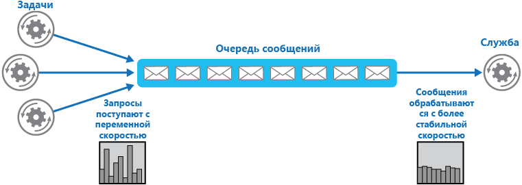
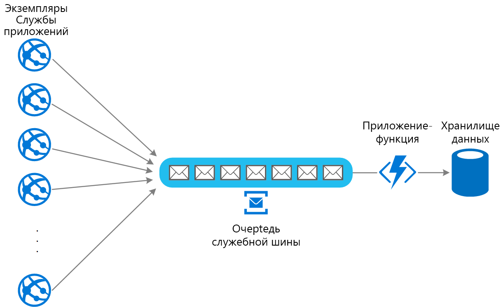

# Шаблон балансировки нагрузки на основе очередей

Для сглаживания кратковременных всплесков нагрузки используйте очередь, которая служит буфером между задачей и вызываемой ею службой. В противном случае такие всплески могут привести к сбою службы или превышению времени ожидания задания. Это позволяет свести к минимуму всплески нагрузки спроса, влияющие на доступность и скорость реагирования, как для задачи, так и для службы.

## Контекст и проблема

Многие решения в облаке используют выполняемые задачи, которые вызывают службы. В этой среде, если служба подвергается кратковременным всплескам нагрузки, то могут возникать проблемы с производительностью или надежностью.

Служба может быть частью того же решения, что и задачи, которые ее используют. Или это может быть сторонняя служба, предоставляющая доступ к часто используемым ресурсам, таким как кэш или служба хранилища. Если одна служба используется рядом задач, выполняемых одновременно, то может быть сложно предсказать число запросов к службе в любое время.

В службе могут возникать всплески нагрузки спроса, которые приводят к ее перегрузке и неспособности своевременно отвечать на запросы. Наполнение службы большим числом одновременных запросов также может приводить к сбоям в работе службы, если она не может справиться с конфликтом, вызываемым этими запросами.

## Решение

Выполните рефакторинг решения и создайте очередь между задачей и службой. Задача и служба выполняются асинхронно. Задача отправляет сообщение, содержащее данные, необходимые службе для очереди. Очередь работает как буфер, сохраняя сообщение, пока оно не будет извлечено службой. Служба извлекает сообщения из очереди и обрабатывает их. Запросы от ряда задач, которые могут создаваться с крайне изменчивой скоростью, можно передавать в службу с помощью той же очереди сообщений. На этом рисунке показано использование очереди для балансировки нагрузки в службе.

Очередь отделяет задачи из службы, а служба может обрабатывать сообщения в удобном для нее темпе, независимо от числа запросов от параллельных задач. Кроме того, отсутствует задержка, связанная с задачей, если служба недоступна в тот момент, когда она отправляет сообщение в очередь.

Такой подход обеспечивает следующие преимущества:

- Он помогает добиться максимальной доступности, так как задержки, возникающие в службах, не будут оказывать немедленное и прямое влияние на приложение, которое может по-прежнему отправлять сообщения в очередь, даже если служба в данный момент недоступна или не обрабатывает сообщения.
- Он позволяет добиться максимальной масштабируемости, так как для удовлетворения спроса можно изменять как количество очередей, так и количество служб.
- Он помогает контролировать затраты, так как число развернутых экземпляров службы должно быть достаточным для обработки средней нагрузки, а не пиковой нагрузки.

    >  Некоторые службы применяют регулирование количества запросов, когда спрос достигает порогового значения, за которым может произойти сбой системы. Регулирование количества запросов может сократить число доступных функциональных возможностей. С помощью этих служб можно реализовать балансировку нагрузки, чтобы пороговое значение не достигалось.

## Проблемы и рекомендации

При принятии решения о реализации этого шаблона необходимо учитывать следующие моменты.

- Во избежание перегрузки целевого ресурса необходимо реализовать логику приложения, контролирующую скорость, с которой службы обрабатывают сообщения. Избегайте передачи пиковых нагрузок спроса в следующую стадию системы. Протестируйте систему под нагрузкой, чтобы убедиться, что она обеспечивает необходимую балансировку, а также настройте количество очередей и экземпляров службы, которые обрабатывают сообщения, для достижения этой цели.
- Очереди сообщений представляют собой механизм односторонней связи. Если задача ожидает ответа от службы, то может потребоваться реализовать механизм, который служба может использовать для отправки ответа. Дополнительные сведения см. в [руководстве по асинхронному обмену сообщениями](https://msdn.microsoft.com/library/dn589781.aspx).
- Будьте внимательны, применяя автоматическое масштабирование к службам, которые ожидают передачи запросов в очереди. Это может вызвать дополнительные конфликты для любых ресурсов, совместно используемых этими службами, и снизить эффективность использования очереди при балансировке нагрузки.

## Когда следует использовать этот шаблон

Этот шаблон полезен для любого приложения, использующего службы, которые подвержены перегрузкам.

Этот шаблон не будет полезен, если приложение ожидает ответа от службы с минимальной задержкой.

## Пример

Веб-приложение записывает данные во внешнее хранилище данных. Если большое число экземпляров веб-приложения выполняются одновременно, хранилище данных может оказаться неспособным отвечать на запросы достаточно быстро. Это приведет к истечению времени ожидания у запросов, регулированию запросов или сбоям при их обработке. На схеме ниже показана служба, перегруженная большим числом параллельных запросов от экземпляров приложения.

Чтобы устранить эту проблему, можно использовать очередь для балансировки нагрузки между экземплярами приложения и хранилищем данных. Приложение Функций Azure считывает сообщения из очереди и выполняет запросы чтения и записи к хранилищу данных. Логика приложения в приложении-функции может контролировать скорость, с которой это приложение передает запросы в хранилище данных, чтобы предотвратить перегрузку хранилища. (В противном случае приложение-функция просто перенесет эту проблему в серверную часть.)

## Связанные шаблоны и рекомендации

При реализации этого шаблона следует принять во внимание следующие шаблоны и рекомендации.

- [Руководство по асинхронному обмену сообщениями](https://msdn.microsoft.com/library/dn589781.aspx). Очереди сообщений по своей сути асинхронны. Может потребоваться изменить логику приложения в задаче, если ее адаптировали для использования очереди сообщений вместо непосредственного взаимодействия со службой. Аналогичным образом может потребоваться выполнить рефакторинг службы, чтобы принимались запросы из очереди сообщений. Также можно реализовать прокси-службу, как описано в примере.

- [Шаблон конкурирующих потребителей](./competing-consumers.md). Можно запустить несколько экземпляров службы, каждый из которых будет действовать как потребитель сообщений из очереди балансировки нагрузки. Этот подход можно использовать для настройки скорости, с которой сообщения принимаются и передаются в службу.

- [Шаблон регулирования](./throttling.md). Простой способ реализовать регулирование количества запросов с помощью службы — это использовать балансировку нагрузки на основе очередей и перенаправлять все запросы к службе через очередь сообщений. Служба может обрабатывать запросы со скоростью, которая гарантирует, что ресурсы, необходимые для службы, не будут исчерпаны. При этом также сокращается число конфликтов, которые могут возникнуть.

- [Сравнение трех служб обмена сообщениями Azure: Сетка событий, Центры событий и Служебная шина](/azure/event-grid/compare-messaging-services). Сведения о выборе механизма обмена сообщениями и организации очереди в приложениях Azure.

- [Повышение масштабируемости в веб-приложении Azure](../reference-architectures/app-service-web-app/scalable-web-app.md). Эта эталонная архитектура обеспечивает выравнивание нагрузки с использованием очередей, являющихся частью архитектуры.
