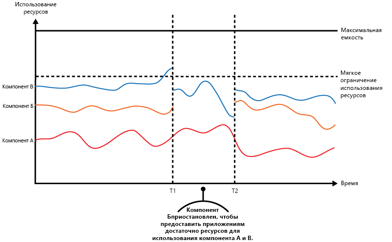
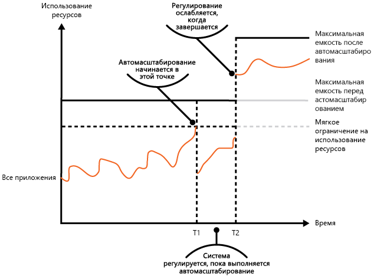

# Шаблон регулирования

[!INCLUDE [header](../_includes/header.md)]

Контролируйте потребление ресурсов, используемых экземпляром приложения, отдельным клиентом или всей службой. Благодаря контролю потребления ресурсов система продолжает работать и выполняет соглашение об уровне обслуживания, даже если растущие потребности приводят к чрезмерной нагрузке на ресурсы.

## Контекст и проблема

Нагрузка на облачное приложение обычно изменяется со временем в зависимости от количества активных пользователей или действий, которые они выполняют. Например, скорее всего, больше активных пользователей будет в рабочее время. Или в конце каждого месяца система будет выполнять аналитику, требующую большого количества вычислительных ресурсов. Могут также возникать неожиданные и непредвиденные всплески активности. Если потребности системы в обработке превышают емкость доступных ресурсов, производительность системы будет очень низкой, и она даже может перестать работать. Если система должна соответствовать установленному уровню обслуживания, такой сбой может быть неприемлемым.

Изменяющуюся нагрузку в облаке можно обрабатывать разными способами. Их выбор зависит от бизнес-целей приложения. Одним из решений может быть автоматическое масштабирование, то есть подготовка тех ресурсов, которые нужны пользователю в конкретный момент. Это создает потенциал для постоянного удовлетворения потребностей пользователей и одновременной оптимизации эксплуатационных расходов. Однако, хотя автоматическое масштабирование инициирует подготовку дополнительных ресурсов, эта операция не выполняется немедленно. Если потребности в ресурсах растут быстро, может возникнуть период дефицита ресурсов.

## Решение

Альтернативная стратегия автоматического масштабирования заключается в том, чтобы позволить приложениям использовать определенное ограниченное количество ресурсов, а затем регулировать приложения по достижении этого ограничения. Система должна отслеживать использование ресурсов, чтобы при превышении порогового значения она могла регулировать запросы от одного или нескольких пользователей. Эта стратегия позволяет системе продолжать работу и выполнять любое соглашение об уровне обслуживания, которое применяется к системе. Дополнительные сведения о мониторинге использования ресурсов см. в [руководстве по инструментированию и телеметрии](https://msdn.microsoft.com/library/dn589775.aspx).

В системе могут быть реализованы несколько стратегий регулирования, в том числе:

- Отклонение запросов от отдельного пользователя, который уже получал доступ к API системы более n раз в секунду в течение определенного периода. Для этого система должна измерять использование ресурсов для каждого клиента или пользователя, использующих приложение. Дополнительные сведения см. в [руководстве по контролю потребления служб](https://msdn.microsoft.com/library/dn589796.aspx).

- Отключение или снижение функциональных возможностей выбранных неосновных служб, что позволяет предоставить достаточное количество ресурсов для беспрепятственной работы основных служб. Например, если приложение выполняет потоковую передачу видео, для него можно включить более низкое разрешение.

- Выравнивание нагрузки для распределения объема операций. Этот подход подробно описан в статье о [шаблоне балансировки нагрузки на основе очередей](./queue-based-load-leveling.md). В среде с поддержкой нескольких клиентов такой подход приведет к снижению производительности для каждого клиента. Если система должна поддерживать разные клиенты с разными соглашениями об уровне обслуживания, запросы более важных клиентов могут обрабатываться немедленно. Запросы других клиентов могут задерживаться и обрабатываться после выполнения более срочных запросов. Для реализации такого подхода можно использовать [шаблон приоритета очередей][].

- Отсрочка операций для приложений или клиентов с более низким приоритетом. Эти операции могут быть приостановлены или ограничены. При этом создается исключение,которое сообщает клиенту, что система занята и операцию следует повторить позже.

На этой диаграмме с областями показано использование ресурсов (сочетание памяти, ЦП, пропускной способности и других факторов) по времени для приложений, которые используют три функции. Функция — это область функциональных возможностей, например компонент, который выполняет определенный набор задач, блок кода, выполняющий сложные вычисления, либо элемент, который реализует какую-то службу, например кэш в памяти. Эти функции обозначены буквами A, B и C.

> Область под линией функции показывает ресурсы, которые используются приложениями при вызове этой функции. Например, область под линией функции А отображает ресурсы, потребляемые приложениями, которые используют функцию А. Область между линиями функций A и B обозначает ресурсы, используемые приложениями, которые вызывают функцию B. Объединив области всех функций, можно определить совокупное использование ресурсов системы.

На рисунке выше показаны результаты задержки операций. Непосредственно перед точкой времени T1 общее число ресурсов, выделенных для всех приложений, использующих эти функции, достигает порогового значения (ограничения на использование ресурсов). На этом этапе существует риск, что приложения исчерпают доступные ресурсы. В этой системе функция B менее важна, чем функции A и C, поэтому она временно отключается и используемые ею ресурсы освобождаются. Между точками времени T1 и T2 приложения, использующие функции A и C, продолжают работать в обычном режиме. Со временем использование ресурсов этими двумя функциями снизится до такой степени, что в момент времени T2 высвободится достаточно ресурсов, чтобы снова включить функцию B.

Автоматическое масштабирование и регулирование можно также совмещать, чтобы обеспечить ответ приложений на запросы и выполнение соглашений об уровне обслуживания. Если ожидается, что потребности в ресурсах будут оставаться высокими, регулирование обеспечивает временное решение, пока развертывается система. На этом этапе можно восстановить полную функциональность системы.

На следующей диаграмме с областями показано общее использование ресурсов всеми приложениями, работающими в системе, по времени. Также здесь показано, как регулирование можно объединить с автоматическим масштабированием.

В момент времени T1 достигнуто пороговое значение, соответствующее мягкому ограничению на использование ресурсов. На этом этапе может начаться горизонтальное масштабирование системы. Но если новые ресурсы не станут доступны достаточно быстро, существующие ресурсы могут быть исчерпаны и произойдет сбой системы. Чтобы предотвратить такое развитие событий, система временно регулируется, как описано выше. После завершения автоматического масштабирования и появления дополнительных ресурсов регулирование можно уменьшить.

## Проблемы и рекомендации

При выборе схемы реализации этого шаблона следует учитывать следующие моменты.

- Регулирование приложения и стратегия его реализации является архитектурным решением, которое влияет на всю структуру системы. Регулирование следует запланировать на раннем этапе разработки приложения, так как его непросто добавить после реализации системы.

- Регулирование должно выполняться быстро. Система должна уметь обнаруживать рост активности и реагировать соответствующим образом. Система также должна уметь быстро восстанавливаться до исходного состояния после уменьшения нагрузки. Для этого необходимо постоянно собирать и отслеживать соответствующие данные производительности.

- Если службе необходимо временно отклонить запрос пользователя, она должна вернуть конкретный код ошибки, чтобы указать клиентскому приложению, что причиной отказа выполнить операцию является регулирование. Клиентское приложение может подождать какое-то время перед повторным выполнением запроса.

- Регулирование может использоваться в качестве временной меры, пока система автоматически масштабируется. Иногда лучше применить регулирование, чем масштабирование, если всплеск активности появился внезапно и не должен длиться долго, так как масштабирование может привести к значительному увеличению затрат.

- Если регулирование используется в качестве временной меры во время автомасштабирования системы и если потребность в ресурсах растет очень быстро, система может работать неправильно &mdash; даже если она работает в режиме регулирования. Если это недопустимая ситуация, попробуйте поддерживать больше резервных ресурсов и настроить интенсивное автоматическое масштабирование.

## Когда следует использовать этот шаблон

Используйте этот шаблон в следующих случаях:

- чтобы гарантировать постоянное соответствие системы соглашению об уровне обслуживания;

- чтобы предотвратить монополизацию ресурсов приложения одним клиентом;

- чтобы справляться со всплесками активности;

- чтобы оптимизировать затраты на систему, ограничивая максимальные уровни ресурсов, необходимые для поддержания работы системы.

## Пример

На последнем рисунке показано, как можно реализовать регулирование в системе, поддерживающей несколько клиентов. Пользователи в каждой клиентской организации получают доступ к размещенному в облаке приложению, в котором они заполняют и отправляют опросы. Инструментирование в приложении контролирует скорость, с которой пользователи отправляют запросы к приложению.

Чтобы пользователи из одного клиента не влияли на скорость реагирования и доступность приложения для других пользователей, ограничивается число запросов в секунду, которые могут отправить пользователи из одного клиента. Приложение блокирует запросы, которые превышают это ограничение.

## Связанные шаблоны и рекомендации

При реализации данного шаблона можно принять во внимание следующие шаблоны и рекомендации:

- [Руководство по инструментированию и телеметрии.](https://msdn.microsoft.com/library/dn589775.aspx) Регулирование зависит от сбора сведений об интенсивности использования службы. Руководство объясняет, как создавать и записывать пользовательские данные мониторинга.
- [Руководство по контролю потребления служб](https://msdn.microsoft.com/library/dn589796.aspx). Описывает, как контролировать потребление служб, чтобы знать, как они используются. С помощью этих сведений можно определить способ регулирования службы.
- [Автоматическое масштабирование](https://msdn.microsoft.com/library/dn589774.aspx). Регулирование может использоваться в качестве временной меры, пока система автоматически масштабируется. Или его можно использовать, чтобы система вообще не выполняла автоматическое масштабирование. Статья содержит сведения о стратегиях автоматического масштабирования.
- [Шаблон балансировки нагрузки на основе очередей](./queue-based-load-leveling.md). Балансировка нагрузки на основе очередей часто используется для реализации регулирования. Очередь может служить буфером, который помогает балансировать скорость доставки в службу запросов, отправляемых приложением.
- [Шаблон очереди с приоритетом](./priority-queue.md). Система может использовать очереди с приоритетом в рамках стратегии регулирования, чтобы поддерживать производительность критически важных или ценных приложений, снижая производительность менее важных приложений.
