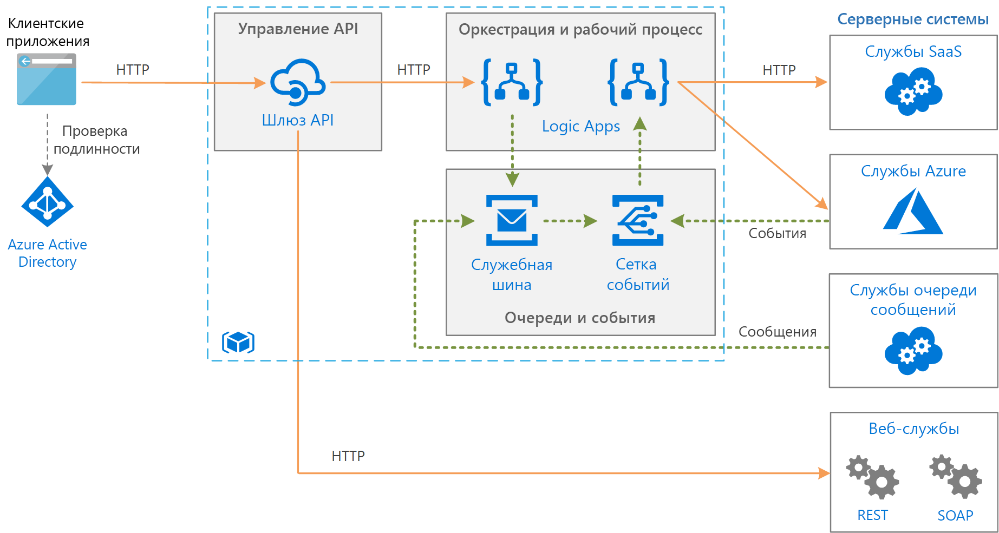

# Корпоративная интеграция в Azure с использованием очередей сообщений и событий

В рамках этой эталонной архитектуры интегрируются внутренние системы предприятия и разделяются задачи между службами с помощью очередей сообщений и событий. Это повышает надежность и масштабируемость. Серверные системы могут включать в себя системы "программное обеспечение как услуга" (SaaS), службы Azure и существующие веб-службы предприятия.

## Архитектура

Показанная здесь архитектура основана на базовой архитектуре, описываемой в статье [Базовые сценарии корпоративной интеграции][basic-enterprise-integration]. В архитектуре используется служба [Logic Apps][logic-apps] для оркестрации рабочих процессов и служба [управление API][apim] для создания каталогов API.

В этом варианте архитектуры добавлены два компонента, повышающих надежность и масштабируемость системы:

- **[Служебная шина Azure][service-bus]**. Это безопасный и надежный брокер сообщений.

- **[Сетка событий Azure][event-grid]**. Это служба маршрутизации событий. Она использует модель событий [публикация и подписка](../../patterns/publisher-subscriber.md) (pub/sub).

Асинхронное взаимодействие с помощью брокера сообщений обеспечивает ряд преимуществ по сравнению с непосредственными синхронными вызовами к серверным службам:

- Обеспечивает выравнивание нагрузки и способность справляться со скачками рабочих нагрузок с помощью [шаблона балансировки нагрузки на основе очередей](../../patterns/queue-based-load-leveling.md).
- Надежно отслеживает ход выполнения длительных рабочих процессов, состоящих из нескольких этапов или связанных с несколькими приложениями.
- Способствует разделению задач между приложениями.
- Интегрируется с существующими системами на основе сообщений.
- Позволяет формировать очередь заданий, если серверная система недоступна.

При использовании Сетки событий Azure различные компоненты системы могут реагировать на события по мере их возникновения. Выполнять опрос или планировать задачи не требуется. Как и в случае с очередью сообщений, Сетка событий Azure способствует разделению задач между приложениями и службами. Приложение или служба публикует события, а все заинтересованные подписчики уведомляются о них. Новые подписчики могут добавляться без обновления отправителя.

Многие службы Azure поддерживают отправку событий в Сетку событий Azure. Например, приложение логики может прослушивать событие при добавлении новых файлов в хранилище BLOB-объектов. Эта архитектура позволяет реализовать реактивные рабочие процессы, когда при передаче файла или помещении сообщения в очередь запускается ряд процессов. Процессы можно выполнять в параллельном режиме или в определенной последовательности.

## Рекомендации

Рекомендации, содержащиеся в статье [Базовые сценарии корпоративной интеграции][basic-enterprise-integration], касаются и этой архитектуры. Также применимы приведенные ниже рекомендации.

### Служебная шина Azure

В Служебной шине доступны два режима доставки: *по запросу* и *принудительно*. В модели по запросу получатель постоянно выполняет опрос на наличие новых сообщений. Опрос может быть неэффективным, особенно при наличии множества очередей, каждая из которых получает несколько сообщений, или больших интервалов между сообщениями. В модели принудительной отправки при появлении новых сообщений Служебная шина отправляет их через Сетку событий. Получатель подписывается на событие. Когда событие активируется, получатель извлекает следующий пакет сообщений из Служебной шины.

Если вы создаете приложение логики для получения сообщений из Служебной шины, рекомендуем использовать модель принудительной отправки, интегрированной с Сеткой событий Azure. Такой вариант часто более экономичен, так как приложению логики не нужно выполнять опрос Служебной шины. Дополнительные сведения см. в статье об [интеграции Служебной шины Azure со службой "Сетка событий"](/azure/service-bus-messaging/service-bus-to-event-grid-integration-concept). Уведомления службы "Сетка событий Azure" сейчас доступны в Служебной шине Azure [ценовой категории "Премиум"](https://azure.microsoft.com/pricing/details/service-bus/).

Используйте режим получения сообщений [PeekLock](/azure/service-bus-messaging/service-bus-messaging-overview#queues) для доступа к группе сообщений. При использовании PeekLock приложение логики может проверять каждое сообщение перед завершением или отменой. Такой подход защищает от случайной потери сообщений.

### Сетка событий Azure

Когда активируется триггер службы "Сетка событий", это означает, что произошло *по крайней мере одно* событие. Например, если приложение логики получает из Сетки событий триггеры сообщения из Служебной шины, скорее всего, для обработки доступно несколько сообщений.

Служба "Сетка событий" использует бессерверную модель. Плата начисляется на основе количества операций (выполнения событий). Дополнительные сведения см. на странице [цен на службу "Сетка событий"](https://azure.microsoft.com/pricing/details/event-grid/). В настоящее время нет рекомендаций по уровню для службы "Сетка событий".

## Вопросы масштабируемости

Служебная шина Azure уровня "Премиум" может горизонтально масштабировать число единиц обмена сообщениями для достижения более высокой масштабируемости. В конфигурациях уровня "Премиум" может быть одна, две или четыре единицы обмена сообщениями. Дополнительные сведения о масштабировании служебной шины см. в статье [Рекомендации по повышению производительности с помощью обмена сообщениями через служебную шину](/azure/service-bus-messaging/service-bus-performance-improvements).

## Вопросы доступности

См. соглашение об уровне обслуживания для каждой службы:

- [Соглашение об уровне обслуживания для службы управления API][apim-sla].
- [Соглашение об уровне обслуживания для Сетки событий Azure][event-grid-sla].
- [Соглашение об уровне обслуживания для Logic Apps][logic-apps-sla].
- [Соглашение об уровне обслуживания для Служебной шины Azure][sb-sla].

Для служебной шины Azure уровня "Премиум" рекомендуется реализовать геоизбыточное аварийное восстановление для отработки отказа при серьезном сбое. Дополнительные сведения см. в разделе [Географическое аварийное восстановление в служебной шине Azure](/azure/service-bus-messaging/service-bus-geo-dr).

## Вопросы безопасности

Защитите служебную шину с помощью подписанного URL-адреса (SAS). Вы можете предоставить пользователю доступ к ресурсам Служебной шины Azure с определенными правами, используя [проверку подлинности на основе SAS](/azure/service-bus-messaging/service-bus-sas). Дополнительные сведения см. в разделе [Аутентификация и авторизация в служебной шине](/azure/service-bus-messaging/service-bus-authentication-and-authorization).

Если очередь служебной шины должна быть предоставлена ​​как конечная точка HTTP (чтобы разрешить публикацию новых сообщений), для ее защиты путем превращения в интерфейсную следует использовать службу управления API. Затем при необходимости вы можете защитить конечную точку с помощью сертификатов или проверки подлинности OAuth. Проще всего защитить конечную точку с помощью приложения логики с триггером HTTP-запросов и HTTP-ответов в качестве посредника.

Служба "Сетка событий" защищает доставку событий с помощью кода проверки. Если вы используете события с помощью Logic Apps, проверка выполняется автоматически. Дополнительные сведения см. в разделе [Сетка событий: безопасность и проверка подлинности](/azure/event-grid/security-authentication).

[apim]: /azure/api-management
[apim-sla]: https://azure.microsoft.com/support/legal/sla/api-management/
[event-grid]: /azure/event-grid/
[event-grid-sla]: https://azure.microsoft.com/support/legal/sla/event-grid
[logic-apps]: /azure/logic-apps/logic-apps-overview
[logic-apps-sla]: https://azure.microsoft.com/support/legal/sla/logic-apps
[sb-sla]: https://azure.microsoft.com/support/legal/sla/service-bus/
[service-bus]: /azure/service-bus-messaging/
[basic-enterprise-integration]: ./basic-enterprise-integration.md
