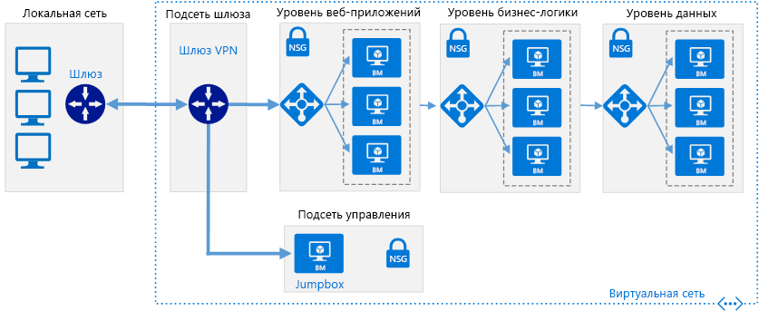
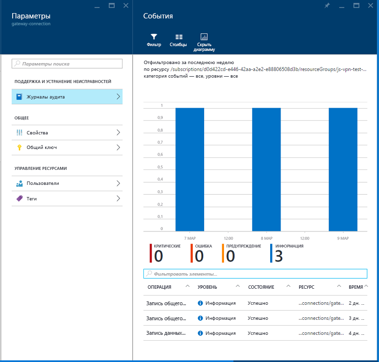

# Подключение локальной сети к Azure с помощью VPN-шлюза

На схеме этой эталонной архитектуры представлены сведения о том, как расширить локальную сеть в Azure с помощью подключения VPN "сеть — сеть". Трафик проходит между локальной сетью и виртуальной сетью Azure через VPN-туннель IPSec. [**Разверните это решение**](#deploy-the-solution).

*Скачайте [файл Visio][visio-download] этой архитектуры.*

## Архитектура

Архитектура состоит из следующих компонентов:

- **Локальная сеть.** Частная локальная сеть, работающая внутри организации.

- **VPN-устройство.** Устройство или служба, предоставляющая возможность внешнего подключения к локальной сети. VPN-устройство может быть аппаратным устройством или программным решением, таким как служба маршрутизации и удаленного доступа (RRAS) в Windows Server 2012. Список поддерживаемых VPN-устройств и сведения об их настройке для подключения к VPN-шлюзу Azure см. в инструкциях для выбранного устройства в статье [VPN-устройства и параметры IPsec/IKE для подключений типа "сеть — сеть" через VPN-шлюз][vpn-appliance].

- **Виртуальная сеть**. Облачное приложение и компоненты для VPN-шлюза Azure находятся в одной [виртуальной сети][azure-virtual-network].

- **VPN-шлюз Azure.** Служба [VPN-шлюза][azure-vpn-gateway] позволяет вам подключать виртуальную сеть к локальной через VPN-устройство. Дополнительные сведения см. в статье [Подключение локальной сети к виртуальной сети Microsoft Azure][connect-to-an-Azure-vnet]. VPN-шлюз содержит следующие элементы:

  - **Шлюз виртуальной сети.** Ресурс, предоставляющий виртуальное VPN-устройство для виртуальной сети. Он отвечает за маршрутизацию трафика от локальной сети к виртуальной.
  - **Шлюз локальной сети.** Абстракция локального VPN-устройства. Сетевой трафик из облачного приложения к локальной сети направляется через этот шлюз.
  - **Подключение.** У соединения есть свойства, указывающие тип соединения (IPSec) и общий ключ с VPN-устройством в локальной среде для шифрования трафика.
  - **Подсеть шлюза**. Шлюз виртуальной сети находится в собственной подсети с различными требованиями, описанными ниже в разделе рекомендаций.

- **Облачное приложение.** Приложение, размещенное в Azure. Оно может содержать несколько уровней с несколькими подсетями, подключенными через подсистемы балансировки нагрузки Azure. Дополнительные сведения об инфраструктуре приложений см. в статьях [Запуск рабочих нагрузок на виртуальных машинах Windows][windows-vm-ra] и [Запуск рабочих нагрузок на виртуальной машине Linux][linux-vm-ra].

- **Внутренний балансировщик нагрузки**. Сетевой трафик от VPN-шлюза направляется в облачное приложение через внутреннюю подсистему балансировки нагрузки. Подсистема балансировки нагрузки находится в интерфейсной подсети приложения.

## Рекомендации

Следующие рекомендации применимы для большинства ситуаций. Следуйте этим рекомендациям, если они не противоречат особым требованиям для вашего случая.

### Виртуальная сеть и подсеть шлюза

Создайте виртуальную сеть Azure с адресным пространством, способным вместить все необходимые ресурсы. Убедитесь, что адресное пространство виртуальной сети имеет достаточно места для расширения, которое может потребоваться в будущем для дополнительных виртуальных машин. Адресное пространство виртуальной сети не должно перекрываться с локальной сетью. Например, на схеме выше для виртуальной сети используется адресное пространство 10.20.0.0/16.

Создайте подсеть с именем *Подсеть шлюза* с диапазоном адресов /27. Эта подсеть необходима для шлюза виртуальной сети. Выделение 32 адресов этой подсети поможет предотвратить достижение ограничения размера шлюза в будущем. Избегайте также размещения этой подсети в середине адресного пространства. Мы рекомендуем задать адресное пространство подсети шлюза в верхней границе адресного пространства виртуальной сети. На примере, приведенном на схеме, используется 10.20.255.224/27.  Вот краткая процедура вычисления [CIDR]:

1. Установите для переменных битов в адресном пространстве виртуальной сети значение 1, по количеству битов, используемых подсетью шлюза, а затем задайте для оставшихся битов значение 0.
2. Преобразуйте получившиеся биты в десятичное число и выразите его в виде адресного пространства с длиной префикса, установленной по размеру подсети шлюза.

Например, при применении шага 1 диапазон IP-адресов виртуальной сети 10.20.0.0/16 превращается в 10.20.0b11111111.0b11100000.  При преобразовании этого десятичного числа и его выражении в виде адресного пространства получаем такой результат: 10.20.255.224/27.

> [!WARNING]
> Не развертывайте виртуальные машины в подсети шлюза. Кроме того, не назначайте группу безопасности сети для этой подсети, так как это приведет к прекращению работы шлюза.
>

### Шлюз виртуальной сети

Выделите общедоступный IP-адрес для шлюза виртуальной сети.

Создайте шлюз виртуальной сети в подсети шлюза и назначьте ему только что выделенный общедоступный IP-адрес. Используйте тип шлюза, который больше всего соответствует вашим требованиям и поддерживается вашим VPN-устройством:

- Создайте [шлюз на основе политики][policy-based-routing], если необходимо тщательно управлять маршрутизацией запросов на основе критериев политики, как, например, префиксов адресов. Шлюзы на основе политики используют статическую маршрутизацию и работают только с подключениями типа "сеть — сеть".

- Создайте [шлюз на основе маршрутов][route-based-routing] при подключении к локальной сети с помощью службы RRAS, поддержке многосайтовых или межрегиональных подключений или реализации подключения типа "виртуальная сеть — виртуальная сеть" (включая маршруты через несколько виртуальных сетей). Шлюзы на основе маршрутов используют динамическую маршрутизацию для направления трафика между сетями. Они надежнее при сбоях в сетевом пути, чем статические маршруты, так как они могут использовать альтернативные маршруты. Шлюзы на основе маршрутов могут также снижать накладные расходы на управление, так как маршруты не потребуется обновлять вручную при изменении сетевых адресов.

Список поддерживаемых VPN-устройств см. в статье [VPN-устройства и параметры IPsec/IKE для подключений типа "сеть — сеть" через VPN-шлюз][vpn-appliances].

> [!NOTE]
> После создания шлюза изменить его тип нельзя. Для этого придется удалить шлюз, а затем создать его снова.
>

Выберите SKU VPN-шлюза Azure, который больше всего соответствует требованиям к пропускной способности. Дополнительные сведения см. в разделе о [номерах SKU шлюзов][azure-gateway-skus]

> [!NOTE]
> SKU "Базовый" несовместим с Azure ExpressRoute. [SKU можно изменить][changing-SKUs] после создания шлюза.
>

Плата взимается за каждый час использования предоставленного и доступного шлюза. Дополнительные сведения см. на странице [цен на VPN-шлюз][azure-gateway-charges].

Создайте правила маршрутизации для подсети шлюза, направляющей входящий трафик приложения из шлюза к внутренней подсистеме балансировки нагрузки, а не разрешающей передачу запросов непосредственно в виртуальные машины приложения.

### Локальное сетевое подключение

Создайте локальный сетевой шлюз. Укажите общедоступный IP-адрес локального VPN-устройства, а также адресное пространство локальной сети. Обратите внимание, что локальному VPN-устройству необходим открытый IP-адрес, доступный на шлюзе локальной сети в VPN-шлюзе Azure. VPN-устройство не может располагаться вне устройства преобразования сетевых адресов (NAT).

Создайте подключения типа "сеть — сеть" для шлюза виртуальной и локальной сети. Выберите подключение типа "сеть — сеть" (IPSec) и укажите общий ключ. Подключение типа "сеть — сеть" с VPN-шлюзом Azure шифруется на основе протокола IPSec с использованием предварительного ключа для проверки подлинности. Укажите ключ при создании VPN-шлюза Azure. Необходимо настроить VPN-устройство, запущенное локально с тем же ключом. Сейчас другие механизмы проверки подлинности не поддерживаются.

Убедитесь, что инфраструктура локальной маршрутизации настроена для переадресации запросов по адресам в виртуальной сети Azure VPN-устройству.

В локальной сети откройте любые порты, необходимые для облачного приложения.

Проверьте подключение, чтобы убедиться в следующем:

- Локальное VPN-устройство правильно направляет трафик в облачное приложение через VPN-шлюз Azure.
- Виртуальная сеть правильно направляет трафик обратно в локальную сеть.
- Запрещенный трафик в обоих направлениях блокируется соответствующим образом.

## Вопросы масштабируемости

Вы можете достичь предела вертикального масштабирования, перейдя с SKU "Базовый" или "Стандартный" VPN-шлюза к SKU VPN "Высокопроизводительный".

Для виртуальных сетей, в которых ожидается большой объем VPN-трафика, рассмотрите возможность распределения разных рабочих нагрузок по отдельным небольшим виртуальным сетям и настройки VPN-шлюза для каждой из них.

Виртуальную сеть можно разделить горизонтально или вертикально. Для разделения по горизонтали переместите некоторые экземпляры виртуальных машин из каждого уровня в подсети новой виртуальной сети. При этом каждая виртуальная сеть будет иметь одинаковую структуру и функциональные возможности. Для разделения по вертикали переопределите каждый уровень, чтобы разделить функциональные возможности на разные логические области (например, обработка заказов, выставление счетов, управление учетными записями пользователей и т. д.). Каждую функциональную область можно поместить в собственную виртуальную сеть.

Репликация локального контроллера домена Active Directory в виртуальной сети, а также реализация DNS в виртуальной сети помогает сократить объем трафика, связанного с безопасностью и администрированием, передаваемого из локальной среды в облако. Дополнительные сведения см. в статье [Расширение доменных служб Active Directory в Azure][adds-extend-domain].

## Вопросы доступности

Если необходимо убедиться, что локальная сеть остается доступной для VPN-шлюза Azure, реализуйте отказоустойчивый кластер для локального VPN-шлюза.

Если в вашей организации есть несколько локальных сайтов, создайте [многосайтовые подключения][vpn-gateway-multi-site] для одной или нескольких виртуальных сетей Azure. Этот подход требует динамической (на основе маршрута) маршрутизации, поэтому убедитесь, что локальный VPN-шлюз поддерживает эту функцию.

Дополнительные сведения о соглашениях об уровне обслуживания для VPN-шлюза см. [здесь][sla-for-vpn-gateway].

## Вопросы управляемости

Наблюдайте за диагностическими сведениями с локального VPN-устройства. Этот процесс зависит от функций, предоставляемых VPN-устройством. Например, если используется служба маршрутизации и удаленного доступа на базе Windows Server 2012 ([ведение журнала для RRAS][rras-logging]).

Используйте [диагностику VPN-шлюза Azure][gateway-diagnostic-logs], чтобы получить сведения о проблемах с подключением. Эти журналы можно использовать для отслеживания сведений, таких как источник и назначение запросов на соединение, использованный протокол и способ установки подключения (или причина сбоя).

Отслеживайте операционные журналы VPN-шлюза Azure с помощью журналов аудита, доступных на портале Azure. Отдельные журналы доступны для шлюза локальной сети, шлюза сети Azure и подключения. Эти сведения можно использовать для отслеживания любых изменений шлюза. Они пригодятся, если функционирующий шлюз вдруг прекратит свою работу по какой-либо причине.

Наблюдайте за подключениями и отслеживайте соответствующие сбои. Для регистрации этих сведений и формирования отчетов на их основе можно воспользоваться пакетом для мониторинга, например [Nagios][nagios].

## Вопросы безопасности

Создайте разные общие ключи для каждого VPN-шлюза. Используйте надежный общий ключ для защиты от атак методом подбора.

> [!NOTE]
> В настоящее время нельзя использовать Azure Key Vault для предварительного предоставления ключей VPN-шлюза Azure.
>

Убедитесь, что локальное VPN-устройство использует метод шифрования, [совместимый с VPN-шлюзом Azure][vpn-appliance-ipsec]. Для маршрутизации на основе политик VPN-шлюз Azure поддерживает алгоритмы шифрования AES256, AES128 и 3DES. Шлюзы на основе маршрута поддерживают AES256 и 3DES.

Если ваше локальное VPN-устройство находится в сети периметра с брандмауэром между ней и Интернетом, то может потребоваться настроить [дополнительные правила брандмауэра][additional-firewall-rules], разрешающие VPN-подключение "сеть — сеть".

Если приложение в виртуальной сети отправляет данные в Интернет, следует рассмотреть возможность [реализации принудительного туннелирования][forced-tunneling], чтобы направлять весь интернет-трафик через локальную сеть. Такой подход позволяет производить аудит исходящих запросов приложения из локальной инфраструктуры.

> [!NOTE]
> Принудительное туннелирование может повлиять на возможность подключения к службам Azure (например, к службе хранилища) и к службе Windows License Manager.
>

## Развертывание решения

**Предварительные требования**. Вам необходима настроенная локальная инфраструктура с подходящим сетевым устройством.

Чтобы развернуть решение, сделайте следующее.

<!-- markdownlint-disable MD033 -->

1. Нажмите кнопку ниже: 
2. Подождите, пока на портале Azure не откроется ссылка, а затем сделайте следующее:
   - Имя **группы ресурсов** уже определено в файле параметров, поэтому выберите **Создать** и введите `ra-hybrid-vpn-rg` в текстовом поле.
   - В раскрывающемся списке **Расположение** выберите регион.
   - Не изменяйте поля **Template Root Uri** (Корневой URI шаблона) или **Parameter Root Uri** (Корневой URI параметра).
   - Прочтите условия использования и установите флажок **Я принимаю указанные выше условия**.
   - Нажмите кнопку **Приобрести**.
3. Дождитесь завершения развертывания.

<!-- markdownlint-enable MD033 -->

См. инструкции по [устранению неполадок при гибридном VPN-подключении](./troubleshoot-vpn.md).

<!-- links -->

[adds-extend-domain]: ../identity/adds-extend-domain.md
[windows-vm-ra]: ../virtual-machines-windows/index.md
[linux-vm-ra]: ../virtual-machines-linux/index.md

[azure-cli]: /azure/virtual-machines-command-line-tools
[azure-virtual-network]: /azure/virtual-network/virtual-networks-overview
[vpn-appliance]: /azure/vpn-gateway/vpn-gateway-about-vpn-devices
[azure-vpn-gateway]: https://azure.microsoft.com/services/vpn-gateway/
[azure-gateway-charges]: https://azure.microsoft.com/pricing/details/vpn-gateway/
[azure-gateway-skus]: /azure/vpn-gateway/vpn-gateway-about-vpngateways#gwsku
[connect-to-an-Azure-vnet]: https://technet.microsoft.com/library/dn786406.aspx
[vpn-gateway-multi-site]: /azure/vpn-gateway/vpn-gateway-multi-site
[policy-based-routing]: https://en.wikipedia.org/wiki/Policy-based_routing
[route-based-routing]: https://en.wikipedia.org/wiki/Static_routing
[sla-for-vpn-gateway]: https://azure.microsoft.com/support/legal/sla/vpn-gateway/
[additional-firewall-rules]: https://technet.microsoft.com/library/dn786406.aspx#firewall
[nagios]: https://www.nagios.org/
[changing-SKUs]: https://azure.microsoft.com/blog/azure-virtual-network-gateway-improvements/
[gateway-diagnostic-logs]: https://blogs.technet.microsoft.com/keithmayer/2016/10/12/step-by-step-capturing-azure-resource-manager-arm-vnet-gateway-diagnostic-logs/
[rras-logging]: https://www.petri.com/enable-diagnostic-logging-in-windows-server-2012-r2-routing-and-remote-access
[forced-tunneling]: https://azure.microsoft.com/documentation/articles/vpn-gateway-about-forced-tunneling/
[vpn-appliances]: /azure/vpn-gateway/vpn-gateway-about-vpn-devices
[visio-download]: https://archcenter.blob.core.windows.net/cdn/hybrid-network-architectures.vsdx
[vpn-appliance-ipsec]: /azure/vpn-gateway/vpn-gateway-about-vpn-devices#ipsec-parameters
[azure-cli]: https://azure.microsoft.com/documentation/articles/xplat-cli-install/
[CIDR]: https://en.wikipedia.org/wiki/Classless_Inter-Domain_Routing
