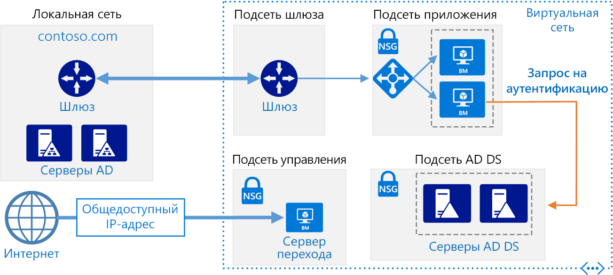
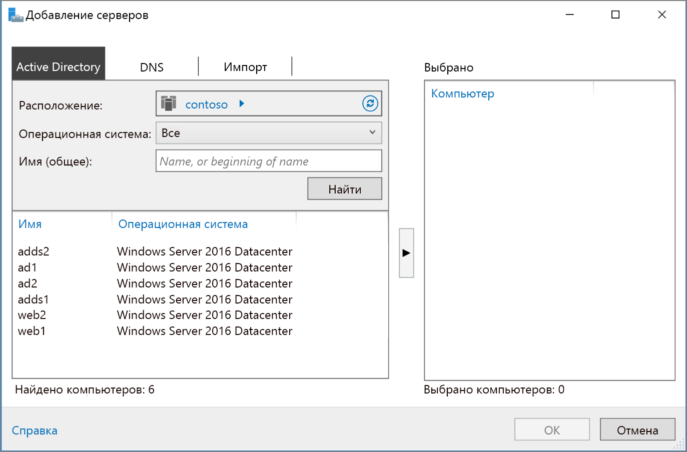

# <a name="extend-active-directory-domain-services-ad-ds-to-azure"></a>Расширение доменных служб Active Directory в Azure

На схеме эталонной архитектуры представлены способы расширения среды Active Directory в Azure для предоставления распределенных служб аутентификации с помощью доменных служб Active Directory (AD DS). [**Разверните это решение**](#deploy-the-solution).



*Скачайте [файл Visio][visio-download] этой архитектуры.*

С помощью доменных служб Active Directory вы можете выполнить аутентификацию пользователя, компьютера, приложения или других идентификаторов, которые включены в домен безопасности. Они могут быть размещены локально. Если же приложение размещено частично локально и частично в Azure, эффективней выполнить репликацию этой функциональности в Azure. Это позволяет сократить задержки, вызванные отправкой запросов на аутентификацию и локальную авторизацию из облака обратно в доменные службы Active Directory, запущенные в локальной среде.

Эта архитектура чаще всего используется при подключении к локальной и виртуальной сети Azure по VPN или ExpressRoute. Она также поддерживает двунаправленную репликацию. Это означает, что изменения могут быть выполнены локально или в облаке и оба источника будут согласованы. Типичные способы применения этой архитектуры включают гибридные приложения, в которых функции распределяются между локальными приложениями и Azure, а также приложения и службы, которые выполняют аутентификацию с помощью Active Directory.

Дополнительные рекомендации см. в статье [Выбор решения для интеграции локальной среды Active Directory с Azure][considerations].

## <a name="architecture"></a>Архитектура

Эта архитектура расширяет архитектуру, описанную в статье [DMZ between Azure and the Internet][implementing-a-secure-hybrid-network-architecture-with-internet-access] (Сеть периметра между Azure и Интернетом). Она содержит следующие компоненты.

- **Локальная сеть.** Локальная сеть включает локальные серверы Active Directory, которые могут выполнять аутентификацию и авторизацию для компонентов, установленных локально.
- **Серверы Active Directory**. Они являются контроллерами домена, которые реализуют службы каталогов (AD DS), работающие в облаке в качестве виртуальных машин. Эти серверы могут выполнить аутентификацию компонентов, работающих в виртуальной сети Azure.
- **Подсеть Active Directory**. Серверы доменных служб Active Directory находятся в отдельной подсети. Правила группы безопасности сети (NSG) защищают серверы доменных служб Active Directory и предоставляют брандмауэр для трафика из неизвестных источников.
- **Синхронизация шлюза Azure и Active Directory**. Шлюз Azure обеспечивает соединение между локальной и виртуальной сетями Azure. Это может быть [VPN-подключение][azure-vpn-gateway] или [Azure ExpressRoute][azure-expressroute]. Все запросы на синхронизацию между серверами Active Directory локально и в облаке передаются через шлюз. Определенные пользователем маршруты отвечают за маршрутизацию локального трафика, передаваемого в Azure. Трафик от серверов Active Directory не проходит через виртуальный модуль сети (NVAs), используемый в этом сценарии.

Дополнительные сведения см. в статье [DMZ between Azure and your on-premises datacenter][implementing-a-secure-hybrid-network-architecture] (Сеть периметра между Azure и локальным центром обработки данных).

## <a name="recommendations"></a>Рекомендации

Следующие рекомендации применимы для большинства ситуаций. Следуйте этим рекомендациям, если они не противоречат особым требованиям для вашего случая.

### <a name="vm-recommendations"></a>Рекомендации по виртуальным машинам

Определите требования к [размеру виртуальной машины][vm-windows-sizes] на основе ожидаемого объема запросов на аутентификацию. В качестве отправной точки используйте спецификации компьютеров, на которых локально размещены AD DS, и сопоставьте их с размерами виртуальных машин Azure. После развертывания отслеживайте использование и регулируйте масштаб на основе фактической нагрузки на виртуальных машинах. Дополнительные сведения об изменении размера контроллеров домена AD DS см. в статье [Capacity Planning for Active Directory Domain Services][capacity-planning-for-adds] (Планирование ресурсов для доменных служб Active Directory).

Создайте отдельный виртуальный диск данных для хранения базы данных, журналов и SYSVOL для Active Directory. Не храните эти элементы на одном диске с операционной системой. Обратите внимание, что диски данных, подключенные к виртуальной машине, используют кэширование со сквозной записью. Однако эта форма кэширования может нарушать требования доменных служб Active Directory. Поэтому для параметра *настройки кэша узла* на диске данных задайте значение *Нет*. См. [рекомендации по развертыванию Windows Server Active Directory на виртуальных машинах Azure][adds-data-disks].

Разверните по крайней мере две виртуальные машины доменных служб Active Directory в качестве контроллеров домена и добавьте их в [группу доступности][availability-set].

### <a name="networking-recommendations"></a>Рекомендации по сети

Настройте сетевой интерфейс виртуальной машины для каждого сервера доменных служб Active Directory с помощью статического частного IP-адреса для поддержки службы доменных имен (DNS). Дополнительные сведения см. в статье [Настройка частных IP-адресов для виртуальной машины с помощью портала Azure][set-a-static-ip-address].

> [!NOTE]
> Не настраивайте сетевой интерфейс виртуальной машины для доменных служб Active Directory с общедоступными IP-адресами. Дополнительные сведения см. в разделе [Вопросы безопасности][security-considerations] этой статьи.
>

Чтобы разрешить входящий трафик из локальной среды, для подсети NSG Active Directory необходимы правила. Подробные сведения о портах, используемых доменными службами Active Directory, см. в статье [Active Directory and Active Directory Domain Services Port Requirements][ad-ds-ports] (Требования доменных служб Active Directory и порта доменных служб Active Directory). Кроме того, убедитесь, что таблицы UDR не направляют трафик доменных служб Active Directory через виртуальные сетевые устройства, используемые в этой архитектуре.

### <a name="active-directory-site"></a>Веб-сайт Active Directory

В доменных службах Active Directory веб-сайт представляет собой физическое расположение, сеть или коллекцию устройств. Сайты доменных служб Active Directory используются для управления репликацией базы данных AD DS путем группирования объектов, которые расположены рядом друг с другом и соединены высокоскоростной сетью. Доменные службы Active Directory включают логику, чтобы выбрать оптимальную стратегию для разделения базы данных между сайтами.

Мы рекомендуем создать сайт доменных служб Active Directory, включая определенные подсети для вашего приложения в Azure. Затем настройте связь между локальными сайтами доменных служб Active Directory, которые автоматически выполнят наиболее эффективную репликацию базы данных. Обратите внимание, что такая репликация требует дополнительных настроек.

### <a name="active-directory-operations-masters"></a>Хозяева операций Active Directory

Роль хозяина операции может быть назначена контроллерам домена AD DS для поддержки проверки целостности между экземплярами реплицируемых баз данных AD DS. Существует пять видов ролей: хозяин схемы, хозяин именования доменов, хозяин относительных идентификаторов, эмулятор хозяина основного контроллера домена и хозяин инфраструктуры. Дополнительные сведения об этих ролях см. в статье [What are Operations Masters?][ad-ds-operations-masters] (Что собой представляет хозяин операции?).

Мы рекомендуем не присваивать роли хозяина операций контроллерам домена, развертываемым в Azure.

### <a name="monitoring"></a>Мониторинг

Отследите ресурсы контроллера домена виртуальных машин, а также службы AD DS и создайте план для быстрого устранения неполадок. Дополнительные сведения см. в документе [Monitoring Active Directory][monitoring_ad] (Мониторинг Active Directory). Вы также можете установить инструменты (например, [Microsoft Systems Center][microsoft_systems_center]) на сервере мониторинга (см. диаграмму архитектуры) для выполнения этих задач.

## <a name="scalability-considerations"></a>Вопросы масштабируемости

Доменные службы Active Directory предназначены для масштабируемости. Вам не нужно настраивать подсистему балансировки нагрузки или контроллер трафика, чтобы направлять запросы к контроллерам домена AD DS. Единственное, что следует учитывать для масштабируемости, — это настройка виртуальных машин, запущенных AD DS, с оптимальным размером соответственно требованиям нагрузки сети, мониторинг нагрузки на виртуальных машинах и масштабирование при необходимости.

## <a name="availability-considerations"></a>Вопросы доступности

Разверните виртуальные машины, запущенные в доменных службах Active Directory, в [группу доступности][availability-set]. Кроме того, стоит рассмотреть возможность назначения роли [резервного хозяина операций][standby-operations-masters] для по крайней мере одного сервера, а может и для нескольких (в зависимости от требований). Резервный хозяин операций — это активная копия хозяина операций, которая может использоваться вместо основного во время отработки отказа.

## <a name="manageability-considerations"></a>Вопросы управляемости

Выполняйте обычное резервное копирование доменных служб Active Directory. Не копируйте VHD-файлы контроллеров домена вместо выполнения обычного резервного копирования, так как файл базы данных AD DS на виртуальном диске может быть не согласован при копировании, запрещая перезапустить базу данных.

Не выключайте контроллер домена виртуальной машины с помощью портала Azure. Выключайте и перезапускайте его из гостевой операционной системы. Выключение на портале приводит к отмене распределения виртуальной машины, а это сбрасывает `VM-GenerationID` и `invocationID` репозитория Active Directory. Пул относительного идентификатора (RID) доменных служб Active Directory удаляется и SYSVOL помечает как не заслуживающий доверия. Кроме того, может потребоваться перенастройка контроллера домена.

## <a name="security-considerations"></a>Вопросы безопасности

Серверы доменных служб Active Directory предоставляют службы аутентификации и часто подвергаются атакам. Чтобы защитить их, предотвратите прямое подключение к Интернету, поместив серверы AD DS в отдельной подсети с группой безопасности сети в качестве брандмауэра. Закройте все порты на серверах AD DS, за исключением тех, которые необходимы для аутентификации, авторизации и синхронизации с сервером. Дополнительные сведения см. в разделе [Active Directory and Active Directory Domain Services Port Requirements][ad-ds-ports] (Требования доменных служб Active Directory и порта доменных служб Active Directory).

Рассмотрите возможность реализации дополнительного периметра безопасности серверов с помощью двух подсетей и виртуальных сетевых устройств, как описано в статье [DMZ between Azure and your on-premises datacenter][implementing-a-secure-hybrid-network-architecture-with-internet-access] (Сеть периметра между Azure и локальным центром обработки данных).

Зашифруйте диск, содержащий базу данных AD DS, с помощью BitLocker или шифрования диска Azure.

## <a name="deploy-the-solution"></a>Развертывание решения

Пример развертывания для этой архитектуры можно найти на портале [GitHub][github]. Обратите внимание, что для полного развертывания может потребоваться до двух часов, включая создание VPN-шлюза и запуск скриптов, которые настраивают доменные службы Active Directory.

### <a name="prerequisites"></a>Предварительные требования

1. Клонируйте или скачайте ZIP-файл в [репозитории GitHub](https://github.com/mspnp/identity-reference-architectures) либо создайте для него вилку.

2. Установите [Azure CLI 2.0](/cli/azure/install-azure-cli?view=azure-cli-latest).

3. Установите пакет npm [стандартных блоков Azure](https://github.com/mspnp/template-building-blocks/wiki/Install-Azure-Building-Blocks).

   ```bash
   npm install -g @mspnp/azure-building-blocks
   ```

4. Из командной строки, строки bash или строки PowerShell войдите в свою учетную запись Azure, как показано ниже:

   ```bash
   az login
   ```

### <a name="deploy-the-simulated-on-premises-datacenter"></a>Развертывание имитации локального центра обработки данных

1. Перейдите в папку `identity/adds-extend-domain` в репозитории GitHub.

2. Откройте файл `onprem.json` . Найдите экземпляры `adminPassword` и `Password` и добавьте значения для паролей.

3. Выполните следующую команду и дождитесь завершения развертывания:

    ```bash
    azbb -s <subscription_id> -g <resource group> -l <location> -p onprem.json --deploy
    ```

### <a name="deploy-the-azure-vnet"></a>Развертывание виртуальной сети Azure

1. Откройте файл `azure.json` .  Найдите экземпляры `adminPassword` и `Password` и добавьте значения для паролей.

2. В том же файле найдите экземпляры `sharedKey` и введите общие ключи для VPN-подключения.

    ```json
    "sharedKey": "",
    ```

3. Выполните следующую команду и дождитесь завершения развертывания.

    ```bash
    azbb -s <subscription_id> -g <resource group> -l <location> -p azure.json --deploy
    ```

   Разверните ту же группу ресурсов, что и локальная виртуальная сеть.

### <a name="test-connectivity-with-the-azure-vnet"></a>Проверка подключения виртуальной сети Azure

По завершении развертывания можно протестировать подключение к виртуальной сети Azure из моделируемой локальной среды.

1. На портале Azure перейдите к созданной группе ресурсов.

2. Найдите виртуальную машину с именем `ra-onpremise-mgmt-vm1`.

3. Нажмите `Connect`, чтобы открыть сеанс удаленного рабочего стола для виртуальной машины. Имя пользователя — `contoso\testuser`, а пароль — тот, который указан в файле параметров `onprem.json`.

4. Вовремя сеанса удаленного рабочего стола откройте еще один сеанс удаленного рабочего стола к виртуальной машине `adds-vm1` с IP-адресом 10.0.4.4. Имя пользователя — `contoso\testuser`, а пароль — тот, который указан в файле параметров `azure.json`.

5. Во время сеанса подключения к удаленному рабочему столу для `adds-vm1` перейдите к **диспетчеру сервера** и выберите команду **Добавить другие серверы для управления**.

6. На вкладке **Active Directory** нажмите **Найти сейчас**. Вы должны увидеть список AD, доменных служб Active Directory и виртуальных машин с веб-подключением.

   

## <a name="next-steps"></a>Дополнительная информация

- Изучите рекомендации по [созданию леса ресурсов доменных служб Active Directory][adds-resource-forest] в Azure.
- Изучите рекомендации по [созданию инфраструктуры службы федерации Active Directory (AD FS)][adfs] в Azure.

<!-- links -->

[adds-resource-forest]: adds-forest.md
[adfs]: adfs.md
[azure-cli-2]: /azure/install-azure-cli
[azbb]: https://github.com/mspnp/template-building-blocks/wiki/Install-Azure-Building-Blocks
[implementing-a-secure-hybrid-network-architecture]: ../dmz/secure-vnet-hybrid.md
[implementing-a-secure-hybrid-network-architecture-with-internet-access]: ../dmz/secure-vnet-dmz.md

[adds-data-disks]: https://msdn.microsoft.com/en-us/library/mt674703.aspx
[ad-ds-operations-masters]: https://technet.microsoft.com/library/cc779716(v=ws.10).aspx
[ad-ds-ports]: https://technet.microsoft.com/library/dd772723(v=ws.11).aspx
[availability-set]: /azure/virtual-machines/virtual-machines-windows-create-availability-set
[azure-expressroute]: /azure/expressroute/expressroute-introduction
[azure-vpn-gateway]: /azure/vpn-gateway/vpn-gateway-about-vpngateways
[capacity-planning-for-adds]: https://social.technet.microsoft.com/wiki/contents/articles/14355.capacity-planning-for-active-directory-domain-services.aspx
[considerations]: ./considerations.md
[GitHub]: https://github.com/mspnp/identity-reference-architectures/tree/master/adds-extend-domain
[microsoft_systems_center]: https://www.microsoft.com/download/details.aspx?id=50013
[monitoring_ad]: https://msdn.microsoft.com/library/bb727046.aspx
[security-considerations]: #security-considerations
[set-a-static-ip-address]: /azure/virtual-network/virtual-networks-static-private-ip-arm-pportal
[standby-operations-masters]: https://technet.microsoft.com/library/cc794737(v=ws.10).aspx
[visio-download]: https://archcenter.blob.core.windows.net/cdn/identity-architectures.vsdx
[vm-windows-sizes]: /azure/virtual-machines/virtual-machines-windows-sizes

[0]: ./images/adds-extend-domain.png "Защищенная гибридная сетевая архитектура с Active Directory"
